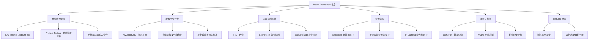

# Robot Framework 多平台自動化測試系統

[](https://python.org)
[](https://robotframework.org)
[](LICENSE)
[]()

## 專案描述

**Robot Framework Multi-Platform Automation Testing System** 是一個基於 Robot Framework 的綜合性自動化測試平台，整合多種測試手段和檢測方式，實現對 **iOS/Android 應用程式**、**硬體設備操作**、**語音控制**和**電源管理**的全方位自動化測試。

### 🎯 主要特色

- 📱 **移動應用測試**: iOS (真機/模擬器) 和 Android (實體裝置/手勢/語音) 自動化測試 ✅ **[已完成]**
- 🤖 **機器手臂控制**: MyCobot 280 機器手臂控制實體面板操作與視覺輔助定位 ✅ **[已完成]**
- 🎤 **語音控制測試**: 本機語音識別、Scarlett 4i4 聲道控制與 TTS ✅ **[已完成]**
- 🔌 **電源管理測試**: SwitchBot 智慧插座控制被測設備開關機 ✅ **[已完成]**
- 📹 **IP Camera 燈光檢測**: RTSP 串流影像擷取與燈光狀態智能分析 ✅ **[已完成]**
- 👁️ **視覺偵測系統**: YOLOv8 燈號檢測、ROI 區域分析與動態影像判斷 ✅ **[已完成]**
- 📊 **TestLink 整合**: 測試案例管理與執行結果自動回報 ✅ **[已完成]**
- 🔄 **整合式測試**: 多設備協同操作的端到端測試流程 (E2E) ✅ **[已完成]**

### 🏗️ 系統架構

系統採用模組化設計，各子系統可獨立運作或協同配合：



## 📂 專案結構

```
robot-multiplatform-automation/
├── 📁 config/                               # 系統配置模組 (iOS/Android/Voice/IPCam)
├── 📁 scripts/                              # 實用工具與校準腳本
│   ├── web_roi_calibrator.py                # 視覺 ROI 校準工具 (v5.0.0)
│   ├── multi_rtsp_viewer.py                 # 多路串流監控工具
│   ├── robot_arm_server.py                  # 手手臂通訊伺服器 (支援視覺檢測)
│   ├── setup_ios_testing.sh                 # iOS 環境部署腳本
│   └── smart_plug_control.py                # 智慧插座硬編碼控制工具
├── 📁 libraries/                            # 自定義 Library 模組
│   ├── 📁 ipcam_light_detection/ ✅         # IP Camera 燈光檢測模組
│   ├── 📁 voice_control/ ✅                 # 語音核心控制 (Scarlett 4i4 / TTS)
│   ├── 📁 robot_arm_control/ ✅             # 機器手臂控制與視覺分析 (v3.0.0)
│   ├── 📁 mobile_testing/ ✅                # Android 實體裝置/手勢/語音控制
│   ├── 📁 switchbot_smartplug_control/ ✅   # SwitchBot 智慧插座控制
│   └── 📁 testlink_integration/ ✅          # TestLink 自動化整合
├── 📁 tests/                                # 測試案例目錄
│   ├── 📁 unit/                             # 單元測試 (Python Library 邏輯驗證)
│   ├── 📁 integration/                      # 整合測試 (各模組功能與硬體互動)
│   ├── 📁 e2e/                              # 端對端測試 (跨設備完整場景)
│   └── 📁 manual/                           # 手動與輔助工具 (包含 TestLink 驗證)
├── 📁 resources/                            # Robot Framework 資源檔 (BDD 關鍵字)
├── 📁 docs/                                 # 系統文檔與開發手冊
├── 📄 spec.md                               # 系統規格書
├── 📄 todo.md                               # 任務清單與開發進度
├── 📄 pyrightconfig.json                    # IDE 靜態分析配置
└── 📄 pyproject.toml                        # UV 專案配置文件
```

## 📚 主要文件

- **[系統規格書](spec.md)**：專案整體功能與架構設計。
- **[機器手臂視覺整合報告](docs/robot_arm_vision/robot_arm_vision_phase3_completion_summary.md)**：Phase 3 視覺檢測整合詳情。
- **[視覺偵測詳細架構](docs/robot_arm_vision/vision_detection_architecture_detailed.md)**：影像分析流程與設計。
- **[任務清單](todo.md)**：目前的開發與維護待辦事項。

## 🔧 核心功能說明

### 📱 Android 實體裝置控制 ✅ **[2026-03-11 完成]**
本專案提供深度整合的 Android 實體裝置控制能力，超越標準 Appium 功能：
- **裝置控制**: 支援藍牙、WiFi、飛航模式切換及音量精確調整。
- **進階手勢**: 支援 `longClickGesture` (長按)、`dragGesture` (拖曳)、`doubleClickGesture` (雙擊) 等實體操作。
- **語音輸入**: 整合音訊硬體觸發 Android 語音搜尋與辨識驗證。
- **測試驗證**: 提供 56 個架構測試案例，確保跨平台 Strategy Pattern 穩定性。

### 🤖 機器手臂視覺整合 (v3.0.0) ✅ **[2025-11-13 完成]**
機器手臂模組現已具備智慧視覺反饋能力：
- **燈號偵測**: 自動偵測按鈕 LED 顏色 (Blue/White/Off)、亮度及狀態。
- **批次檢測**: 單一命令可同時分析多個 ROI 區域，提升效率。
- **穩定性優化**: 增加影像緩衝清除機制 (`warmup_frames`) 與移動確認機制。
- **校準工具**: `web_roi_calibrator.py` 支援一鍵導航手臂至觀測角度。

### 🎤 專業音訊硬體控制 (Scarlett 4i4) ✅
整合 Focusrite Scarlett 4i4 4th Gen 音訊介面的自動化控制，支援 4 聲道獨立輸出測試。

## 🛠️ 安裝與環境設置

### 🖥️ 系統需求
- **作業系統**: macOS 10.15+ 或 Ubuntu 24.04+
- **Python**: 3.8+ (建議 3.11+)
- **工具**: [uv](https://github.com/astral-sh/uv) (推薦用於依賴管理)

### 📋 硬體配置
- **語音系統**: Scarlett 4i4 4th Gen 音訊介面、內建/USB 麥克風與喇叭。
- **機器手臂**: MyCobot 280 (支援 6 軸控制與視覺輔助)。
- **智慧插座**: SwitchBot Smart Plug (支援 HTTP API v1.1)。
- **IP Camera**: 支援 RTSP 的網路攝影機 (支援 HEVC/H.265)。
- **測試設備**: iOS 真機 (iOS 15-18.5)、Android 實體裝置 (Android 11-16)。

### 🔧 快速部署
```bash
# 1. 克隆專案並進入目錄
git clone [repository-url]
cd robot-multiplatform-automation

# 2. 安裝依賴 (推薦使用 uv)
uv sync

# 3. 安裝系統工具 (Ubuntu)
./scripts/setup_ios_testing.sh --install-deps
./scripts/setup_android_testing.sh

# 4. 配置環境變數
cp .env.example .env
# 編輯 .env 設定認證資訊 (TestLink, SwitchBot, IPCam)
```

## 🚀 執行方式與使用指南

### 1. 視覺檢測與手臂操作
```bash
# 執行視覺檢測整合測試
uv run robot tests/robot_arm/vision_integration_test.robot
```

### 2. 移動應用與裝置控制
```bash
# 執行 Android 手勢與裝置控制測試
uv run robot tests/integration/mobile/android_device_control_test.robot
uv run robot tests/integration/mobile/android_gesture_test.robot

# 執行 iOS 真機應用測試
uv run robot tests/mobile/ios/ios_real_device_test.robot
```

### 3. 電源與環境監控
```bash
# 執行 IP Camera 燈光檢測測試
uv run robot tests/integration/ipcam_testing/capture_environment_lights.robot

# 執行智慧插座控制測試
uv run robot tests/integration/power_management/switchbot_plug_test.robot
```

### 🛠️ 輔助校準工具
```bash
# 啟動 Web ROI 校準工具 (Port 5000)
# 支援多環境切換、手臂角度導航、YAML 格式保留
uv run python scripts/web_roi_calibrator.py
```

## 🛠️ 開發規範與 IDE 配置

為確保開發品質與 IDE 分析正確性：
1. **靜態分析**: 本專案使用 `pyrightconfig.json` 統一 Pylance/Pyright 的分析路徑。
2. **關鍵字標準**: 遵循 `Given-When-Then` 結構，所有 Robot 關鍵字應提供 **中文名稱**。
3. **路徑引用**: 優先使用 Package Import (e.g., `from libraries.xxx import ...`)。
4. **代碼檢查**: 修改 Python 程式碼後，請執行 `python3 -m py_compile` 進行基礎檢查。

## 📈 專案發展時程 (Roadmap)

### ✅ Phase 1: 基礎架構與 iOS 支援 (2025-06)
- 統一配置系統與 BDD 中文化關鍵字標準。
- 實現 iOS 真機測試與 Appium 2.x 整合。

### ✅ Phase 2: 電源與音訊整合 (2025-08)
- 整合 SwitchBot 智慧插座與 Scarlett 4i4 聲道控制。
- 實現高品質 TTS 雙引擎播放。

### ✅ Phase 3: 機器手臂視覺整合 (2025-11)
- 實現基於 YOLOv8 的按鈕燈號自動偵測。
- 完成 RobotArmKeywords v3.0.0 與 17 個視覺測試案例。

### ✅ Phase 4: Android 進階控制與穩定性 (2026-03)
- 實現 Android 實體裝置、進階手勢與語音輸入整合。
- 優化 IDE 工作區配置，修復 VScode/Pylance 靜態分析路徑。

### 🚧 Phase 5: 多模態融合與雲端化 (進行中)
- 開發音訊與視覺數據同步分析。
- 完善 TestLink 測試報告自動化分析與缺陷自動同步。

## 🆘 技術支援與日誌

- **日誌路徑**: `logs/` 或各 library 下的 `logs/` 目錄。
- **測試報告**: `results/log.html` 與 `results/report.html`。
- **常見問題**: 請參閱 `docs/robot_arm_vision/vision_detection_troubleshooting_guide.md`。

---
**最後更新**: 2026-04-07  
**維護者**: Owen Ke
