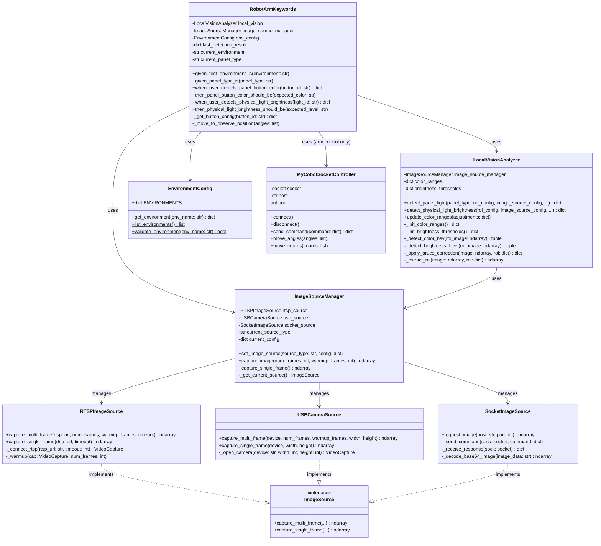
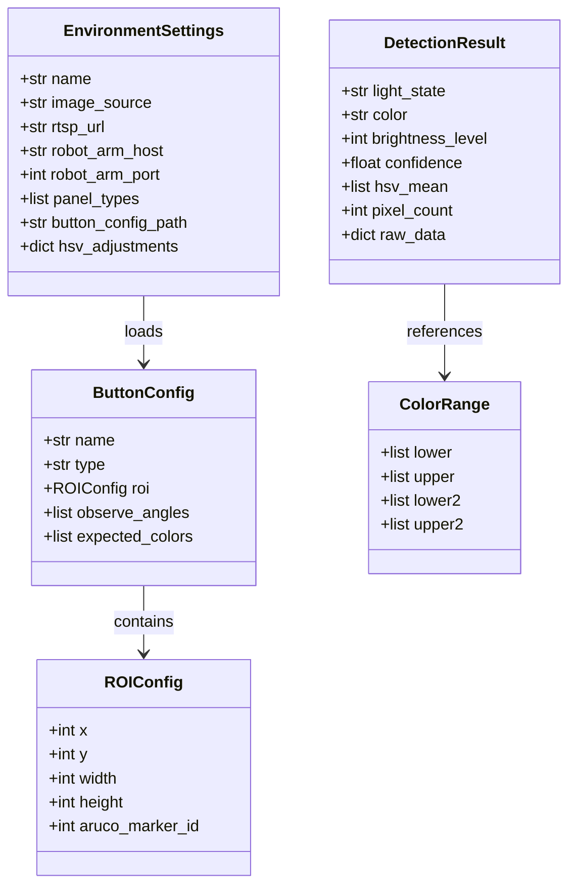
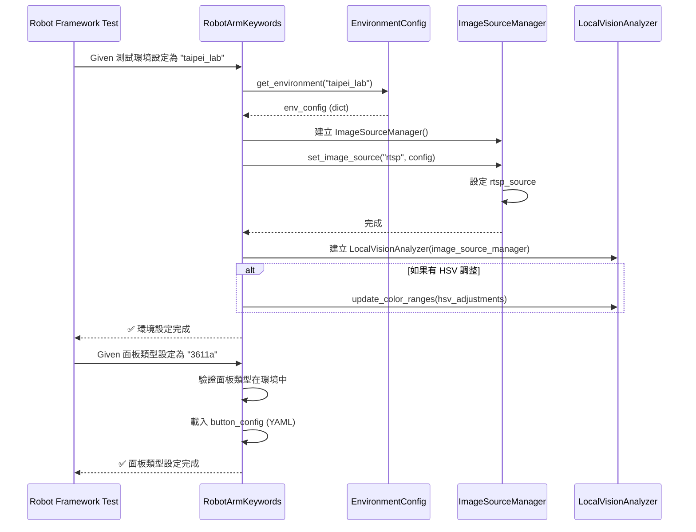
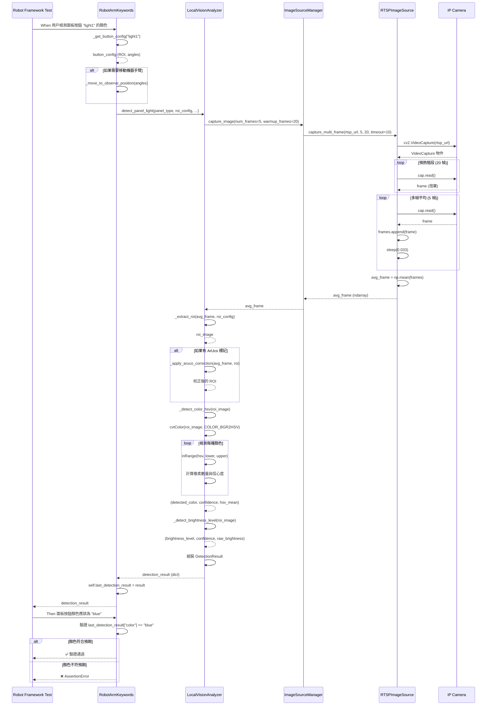
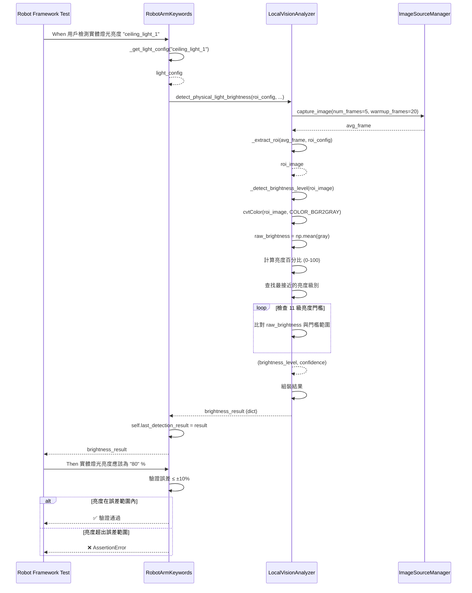
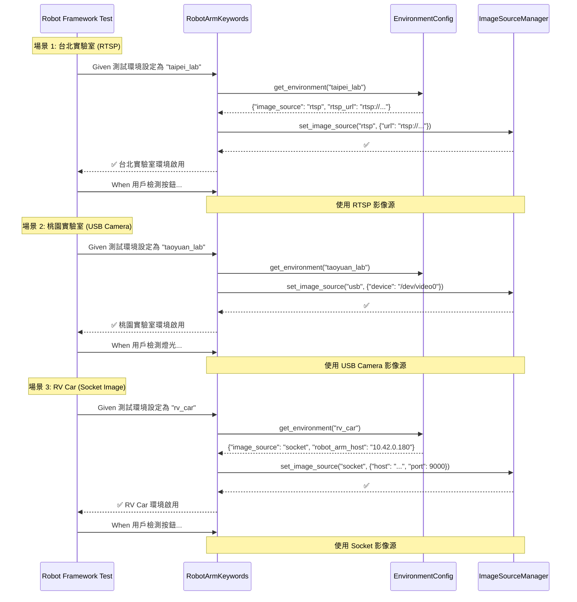
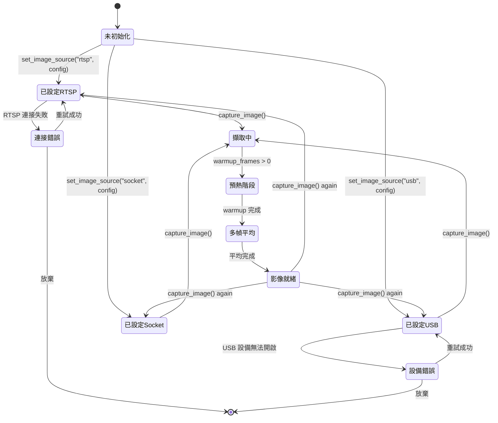
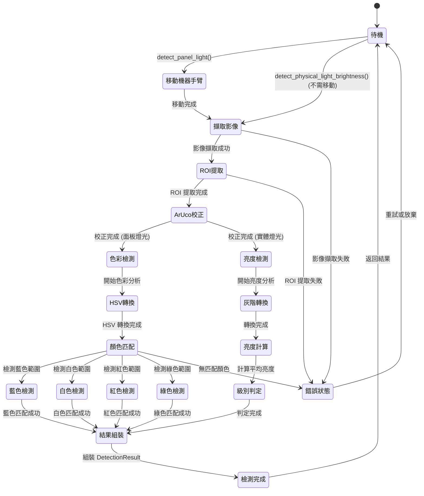
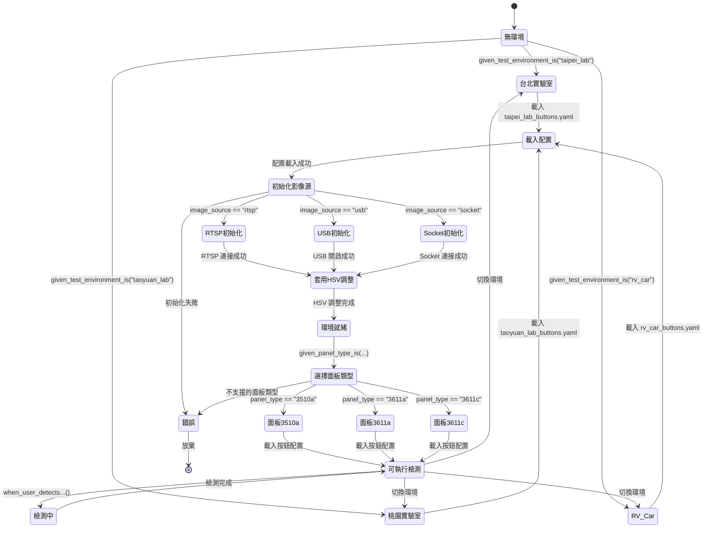

# 影像判定本機化技術規格書

**文件版本**: v1.0.0
**建立日期**: 2025-11-16
**專案**: Robot Framework 多平台自動化測試系統
**規格類型**: Technical Specification (Spec)

---

## 📋 目錄

1. [系統概述](#系統概述)
2. [系統架構](#系統架構)
3. [類別圖](#類別圖)
4. [循序圖](#循序圖)
5. [狀態圖](#狀態圖)
6. [資料模型](#資料模型)
7. [介面規格](#介面規格)
8. [演算法規格](#演算法規格)
9. [性能規格](#性能規格)
10. [安全性規格](#安全性規格)

---

## 系統概述

### 系統名稱

**本機化視覺檢測系統 (Local Vision Detection System)**

### 系統目的

將影像判定功能從 MyCobot 280 Jetson Nano Server 端遷移至 Ubuntu 本機端，提供多環境、多色彩、多級亮度檢測能力。

### 系統範圍

#### 包含功能

✅ **本機視覺分析**
- 多幀平均影像擷取
- HSV 色彩檢測（7+ 種顏色）
- 多級亮度檢測（0-100%，11 級）
- ArUco 標記位置校正
- ROI 區域分析

✅ **雙影像源支援**
- RTSP 串流影像（IP Camera）
- USB 攝影機影像
- Socket 影像（機器手臂 Server）

✅ **多環境配置**
- 台北實驗室
- 桃園實驗室
- RV Car 測試環境

✅ **Robot Framework 整合**
- 26 個現有 BDD 關鍵字（保留）
- 6+ 個新增 BDD 關鍵字

#### 排除功能

❌ 機器手臂控制（保留在 Server 端）
❌ 串口通訊（保留在 Server 端）
❌ 觸控螢幕檢測（未來 Phase）

### 系統假設

1. Ubuntu 本機有足夠運算能力執行影像分析
2. RTSP 串流網路連接穩定（延遲 < 500ms）
3. 環境光源相對穩定
4. ArUco 標記已正確放置

### 系統限制

1. RTSP 串流解析度限制為 1920x1080
2. 多幀平均最多支援 20 幀
3. HSV 顏色檢測依賴光源穩定性
4. 最多支援 10 個環境配置

---

## 系統架構

### 高階架構圖

```
┌─────────────────────────────────────────────────────────────────────────┐
│                       Ubuntu 本機 (Client)                               │
│                                                                           │
│  ┌─────────────────────────────────────────────────────────────────┐   │
│  │                   Presentation Layer                             │   │
│  │  ┌──────────────────────────────────────────────────────────┐   │   │
│  │  │ Robot Framework Tests                                     │   │   │
│  │  │  - multi_environment_test.robot                          │   │   │
│  │  │  - multi_color_detection_test.robot                      │   │   │
│  │  │  - brightness_level_test.robot                           │   │   │
│  │  └──────────────────────────────────────────────────────────┘   │   │
│  └─────────────────────────────────────────────────────────────────┘   │
│                                 │                                        │
│                                 ▼                                        │
│  ┌─────────────────────────────────────────────────────────────────┐   │
│  │                    Business Logic Layer                          │   │
│  │  ┌──────────────────────────────────────────────────────────┐   │   │
│  │  │ RobotArmKeywords (v4.0.0)                                │   │   │
│  │  │  - 26 個現有關鍵字 (向後相容)                            │   │   │
│  │  │  - 6+ 個新增關鍵字 (環境、色彩、亮度)                   │   │   │
│  │  │                                                           │   │   │
│  │  │  ┌─────────────────┐      ┌──────────────────────────┐  │   │   │
│  │  │  │ 環境管理        │      │ 檢測邏輯                 │  │   │   │
│  │  │  │ - 環境切換      │      │ - 面板燈光檢測          │  │   │   │
│  │  │  │ - 配置載入      │      │ - 實體燈光亮度檢測      │  │   │   │
│  │  │  │ - HSV 調整      │      │ - 結果驗證              │  │   │   │
│  │  │  └─────────────────┘      └──────────────────────────┘  │   │   │
│  │  └──────────────────────────────────────────────────────────┘   │   │
│  └─────────────────────────────────────────────────────────────────┘   │
│                                 │                                        │
│                                 ▼                                        │
│  ┌─────────────────────────────────────────────────────────────────┐   │
│  │                    Domain Layer (Core)                           │   │
│  │  ┌──────────────────────────────────────────────────────────┐   │   │
│  │  │ LocalVisionAnalyzer                                       │   │   │
│  │  │  - 多幀平均截圖                                          │   │   │
│  │  │  - HSV 色彩檢測 (7+ 種顏色)                             │   │   │
│  │  │  - 多級亮度檢測 (0-100%, 11 級)                         │   │   │
│  │  │  - ArUco 標記校正                                        │   │   │
│  │  │  - ROI 區域分析                                          │   │   │
│  │  └──────────────────────────────────────────────────────────┘   │   │
│  │                                                                   │   │
│  │  ┌──────────────────────────────────────────────────────────┐   │   │
│  │  │ ImageSourceManager                                        │   │   │
│  │  │  - 統一影像源管理                                        │   │   │
│  │  │  - 影像源切換                                            │   │   │
│  │  │  - 多幀平均介面                                          │   │   │
│  │  │                                                           │   │   │
│  │  │  ┌────────────┐  ┌────────────┐  ┌────────────────┐    │   │   │
│  │  │  │ RTSP       │  │ USB Camera │  │ Socket Image   │    │   │   │
│  │  │  │ Source     │  │ Source     │  │ Source         │    │   │   │
│  │  │  └────────────┘  └────────────┘  └────────────────┘    │   │   │
│  │  └──────────────────────────────────────────────────────────┘   │   │
│  └─────────────────────────────────────────────────────────────────┘   │
│                                 │                                        │
│                                 ▼                                        │
│  ┌─────────────────────────────────────────────────────────────────┐   │
│  │                    Infrastructure Layer                          │   │
│  │  ┌──────────────────────────────────────────────────────────┐   │   │
│  │  │ EnvironmentConfig                                         │   │   │
│  │  │  - taipei_lab / taoyuan_lab / rv_car                     │   │   │
│  │  │  - YAML 配置載入                                         │   │   │
│  │  │  - 環境驗證                                              │   │   │
│  │  └──────────────────────────────────────────────────────────┘   │   │
│  │                                                                   │   │
│  │  ┌──────────────────────────────────────────────────────────┐   │   │
│  │  │ MyCobotSocketController (保留)                           │   │   │
│  │  │  - TCP/IP Socket 連接                                    │   │   │
│  │  │  - 機器手臂控制命令                                      │   │   │
│  │  └──────────────────────────────────────────────────────────┘   │   │
│  └─────────────────────────────────────────────────────────────────┘   │
│                                                                           │
└─────────────────────────────────────────────────────────────────────────┘
                                 │
                                 │ TCP/IP Socket
                                 │ RTSP Stream
                                 │ USB Connection
                                 ▼
┌─────────────────────────────────────────────────────────────────────────┐
│                       外部資源 (External Resources)                      │
│                                                                           │
│  ┌─────────────────────┐   ┌─────────────────────┐                     │
│  │ MyCobot 280 Jetson Nano Server │   │ IP Camera (RTSP)    │                     │
│  │  - 機器手臂控制     │   │  - rtsp://...       │                     │
│  │  - 串口通訊         │   │  - H.264 編碼       │                     │
│  └─────────────────────┘   └─────────────────────┘                     │
│                                                                           │
│  ┌─────────────────────┐                                                │
│  │ USB Camera          │                                                │
│  │  - /dev/video0      │                                                │
│  └─────────────────────┘                                                │
└─────────────────────────────────────────────────────────────────────────┘
```

### 系統分層說明

| 層級 | 名稱 | 職責 | 主要元件 |
|------|------|------|----------|
| **L1** | Presentation Layer | 測試案例定義 | Robot Framework Tests |
| **L2** | Business Logic Layer | 業務邏輯實作 | RobotArmKeywords |
| **L3** | Domain Layer | 核心領域邏輯 | LocalVisionAnalyzer, ImageSourceManager |
| **L4** | Infrastructure Layer | 基礎設施與配置 | EnvironmentConfig, SocketController |
| **L5** | External Resources | 外部硬體與服務 | Server, IP Camera, USB Camera |

### 模組依賴關係

```
┌─────────────────────────────────────────────────────────────┐
│                    Robot Framework Tests                     │
└──────────────────────────┬──────────────────────────────────┘
                           │ depends on
                           ▼
┌─────────────────────────────────────────────────────────────┐
│                    RobotArmKeywords                          │
│                                                               │
│  depends on ↓                       depends on ↓            │
│  ┌────────────────────────┐  ┌──────────────────────────┐  │
│  │ LocalVisionAnalyzer    │  │ ImageSourceManager       │  │
│  └────────────────────────┘  └──────────────────────────┘  │
│             ↓ depends on                ↓ depends on        │
│  ┌────────────────────────┐  ┌──────────────────────────┐  │
│  │ EnvironmentConfig      │  │ RTSPImageSource          │  │
│  │                        │  │ USBCameraSource          │  │
│  │                        │  │ SocketImageSource        │  │
│  └────────────────────────┘  └──────────────────────────┘  │
└─────────────────────────────────────────────────────────────┘
                           │ depends on
                           ▼
┌─────────────────────────────────────────────────────────────┐
│               External Libraries (OpenCV, NumPy)             │
└─────────────────────────────────────────────────────────────┘
```

---

## 類別圖

### 核心類別圖



### 資料類別圖



---

## 循序圖

### 循序圖 1: 環境設定與面板類型設定



### 循序圖 2: 面板按鈕顏色檢測（完整流程）



### 循序圖 3: 實體燈光亮度檢測



### 循序圖 4: 多環境切換流程



---

## 狀態圖

### 狀態圖 1: 影像源狀態機



### 狀態圖 2: 檢測流程狀態機



### 狀態圖 3: 環境配置狀態機



---

## 資料模型

### 實體關係圖 (ERD)

```
┌─────────────────────────────────────────────────────────────────┐
│                         Environment                              │
├─────────────────────────────────────────────────────────────────┤
│ PK  env_name : String                                           │
│     display_name : String                                       │
│     image_source : String (rtsp|usb|socket)                     │
│     rtsp_url : String (nullable)                                │
│     usb_device : String (nullable)                              │
│     robot_arm_host : String                                     │
│     robot_arm_port : Integer                                    │
│     panel_types : List[String]                                  │
│     button_config_path : String                                 │
│     hsv_adjustments : Dict (nullable)                           │
└───────────────────────┬─────────────────────────────────────────┘
                        │ 1
                        │
                        │ has many
                        │
                        ▼ *
┌─────────────────────────────────────────────────────────────────┐
│                         PanelConfig                              │
├─────────────────────────────────────────────────────────────────┤
│ PK  (env_name, panel_type) : (String, String)                  │
│ FK  env_name → Environment.env_name                             │
│     panel_type : String (3510a|3611a|3611c)                     │
└───────────────────────┬─────────────────────────────────────────┘
                        │ 1
                        │
                        │ has many
                        │
                        ▼ *
┌─────────────────────────────────────────────────────────────────┐
│                         ButtonConfig                             │
├─────────────────────────────────────────────────────────────────┤
│ PK  button_id : String                                          │
│ FK  (env_name, panel_type) → PanelConfig                        │
│     name : String                                               │
│     type : String (panel_light|physical_light)                  │
│     roi_x : Integer                                             │
│     roi_y : Integer                                             │
│     roi_width : Integer                                         │
│     roi_height : Integer                                        │
│     observe_angles : List[Float] (6 elements)                   │
│     aruco_marker_id : Integer (nullable)                        │
│     expected_colors : List[String]                              │
└───────────────────────┬─────────────────────────────────────────┘
                        │ *
                        │
                        │ produces
                        │
                        ▼ *
┌─────────────────────────────────────────────────────────────────┐
│                       DetectionResult                            │
├─────────────────────────────────────────────────────────────────┤
│ PK  result_id : UUID                                            │
│ FK  button_id → ButtonConfig.button_id                          │
│     timestamp : DateTime                                        │
│     light_state : String (on|off)                               │
│     color : String (blue|white|red|green|...) (nullable)        │
│     brightness_level : Integer (0-100)                          │
│     confidence : Float (0.0-1.0)                                │
│     hsv_mean : List[Float] ([H, S, V])                          │
│     pixel_count : Integer                                       │
│     raw_brightness : Integer (0-255)                            │
│     raw_data : JSON                                             │
└─────────────────────────────────────────────────────────────────┘
```

### 資料字典

#### Environment Table

| 欄位 | 類型 | 必填 | 說明 | 範例 |
|------|------|------|------|------|
| env_name | String | ✅ | 環境名稱（Primary Key） | "taipei_lab" |
| display_name | String | ✅ | 顯示名稱 | "台北實驗室" |
| image_source | Enum | ✅ | 影像源類型 | "rtsp", "usb", "socket" |
| rtsp_url | String | ❌ | RTSP URL（當 image_source=rtsp） | "rtsp://10.42.0.100:554/stream" |
| usb_device | String | ❌ | USB 設備路徑（當 image_source=usb） | "/dev/video0" |
| robot_arm_host | String | ✅ | 機器手臂 Server IP | "10.42.0.180" |
| robot_arm_port | Integer | ✅ | 機器手臂 Server Port | 9000 |
| panel_types | List[String] | ✅ | 支援的面板類型 | ["3510a", "3611a", "3611c"] |
| button_config_path | String | ✅ | 按鈕配置檔案路徑 | "config/robot_arm/taipei_lab_buttons.yaml" |
| hsv_adjustments | Dict | ❌ | 環境專屬 HSV 調整 | {"blue": {"lower": [95, 50, 50], ...}} |

#### ButtonConfig Table

| 欄位 | 類型 | 必填 | 說明 | 範例 |
|------|------|------|------|------|
| button_id | String | ✅ | 按鈕 ID（Primary Key） | "light1" |
| env_name | String | ✅ | 環境名稱（Foreign Key） | "taipei_lab" |
| panel_type | String | ✅ | 面板類型（Foreign Key） | "3611a" |
| name | String | ✅ | 按鈕名稱 | "燈光按鈕 1" |
| type | Enum | ✅ | 按鈕類型 | "panel_light", "physical_light" |
| roi_x | Integer | ✅ | ROI X 座標 | 320 |
| roi_y | Integer | ✅ | ROI Y 座標 | 200 |
| roi_width | Integer | ✅ | ROI 寬度 | 100 |
| roi_height | Integer | ✅ | ROI 高度 | 100 |
| observe_angles | List[Float] | ✅ | 觀測角度（6 個關節角度） | [7.56, -35.59, -37.96, -15.73, -89.29, 6.06] |
| aruco_marker_id | Integer | ❌ | ArUco 標記 ID | 0 |
| expected_colors | List[String] | ✅ | 預期顏色列表 | ["blue", "white"] |

#### DetectionResult Table

| 欄位 | 類型 | 必填 | 說明 | 範例 |
|------|------|------|------|------|
| result_id | UUID | ✅ | 結果 ID（Primary Key） | "550e8400-e29b-41d4-a716-446655440000" |
| button_id | String | ✅ | 按鈕 ID（Foreign Key） | "light1" |
| timestamp | DateTime | ✅ | 檢測時間 | "2025-11-16T14:30:00Z" |
| light_state | Enum | ✅ | 燈光狀態 | "on", "off" |
| color | String | ❌ | 檢測到的顏色（面板燈光） | "blue", "white", "red", "green" |
| brightness_level | Integer | ✅ | 亮度級別 (0-100) | 80 |
| confidence | Float | ✅ | 信心度 (0.0-1.0) | 0.95 |
| hsv_mean | List[Float] | ✅ | HSV 平均值 | [110.5, 180.2, 220.8] |
| pixel_count | Integer | ✅ | 匹配像素數量 | 8500 |
| raw_brightness | Integer | ✅ | 原始亮度值 (0-255) | 204 |
| raw_data | JSON | ✅ | 原始資料（除錯用） | {"hsv_std": [5.2, 8.1, 10.5], ...} |

---

## 介面規格

### API 介面規格

#### LocalVisionAnalyzer API

##### detect_panel_light()

**功能**: 檢測面板燈光狀態（顏色與亮度）

**方法簽名**:
```python
def detect_panel_light(
    self,
    panel_type: str,
    roi_config: dict,
    image_source_config: dict,
    num_frames: int = 5,
    warmup_frames: int = 20,
    save_debug_images: bool = False
) -> dict:
```

**參數**:

| 參數 | 類型 | 必填 | 預設值 | 說明 |
|------|------|------|--------|------|
| panel_type | str | ✅ | - | 面板型號 ("3510a", "3611a", "3611c") |
| roi_config | dict | ✅ | - | ROI 配置字典 |
| image_source_config | dict | ✅ | - | 影像源配置字典 |
| num_frames | int | ❌ | 5 | 用於平均的幀數 (1-20) |
| warmup_frames | int | ❌ | 20 | 預熱幀數 (0-50) |
| save_debug_images | bool | ❌ | False | 是否儲存除錯影像 |

**roi_config 結構**:
```python
{
    "x": 320,           # ROI X 座標
    "y": 200,           # ROI Y 座標
    "width": 100,       # ROI 寬度
    "height": 100,      # ROI 高度
    "aruco_marker_id": 0  # ArUco 標記 ID (可選)
}
```

**image_source_config 結構** (依影像源類型而異):
```python
# RTSP
{
    "source_type": "rtsp",
    "url": "rtsp://10.42.0.100:554/stream",
    "timeout": 10
}

# USB Camera
{
    "source_type": "usb",
    "device": "/dev/video0",
    "width": 640,
    "height": 480
}

# Socket
{
    "source_type": "socket",
    "host": "10.42.0.180",
    "port": 9000
}
```

**返回值**:
```python
{
    "light_state": "on",              # 燈光狀態 ("on" | "off")
    "color": "blue",                  # 檢測到的顏色 (或 None)
    "brightness_level": 80,           # 亮度級別 (0-100)
    "confidence": 0.95,               # 信心度 (0.0-1.0)
    "hsv_mean": [110.5, 180.2, 220.8], # HSV 平均值
    "pixel_count": 8500,              # 匹配像素數量
    "raw_data": {                     # 原始資料（除錯用）
        "hsv_std": [5.2, 8.1, 10.5],
        "all_color_scores": {
            "blue": 0.95,
            "white": 0.12,
            "red": 0.03,
            "green": 0.05
        }
    }
}
```

**例外**:
- `ValueError`: 參數錯誤（例如：不支援的面板類型）
- `RuntimeError`: 影像擷取失敗或檢測失敗

**使用範例**:
```python
analyzer = LocalVisionAnalyzer(image_source_manager)

roi_config = {
    "x": 320,
    "y": 200,
    "width": 100,
    "height": 100,
    "aruco_marker_id": 0
}

result = analyzer.detect_panel_light(
    panel_type="3611a",
    roi_config=roi_config,
    image_source_config={"source_type": "rtsp", "url": "rtsp://..."},
    num_frames=5,
    warmup_frames=20,
    save_debug_images=True
)

print(f"顏色: {result['color']}, 信心度: {result['confidence']:.2f}")
```

##### detect_physical_light_brightness()

**功能**: 檢測實體燈光亮度

**方法簽名**:
```python
def detect_physical_light_brightness(
    self,
    roi_config: dict,
    image_source_config: dict,
    num_frames: int = 5,
    warmup_frames: int = 20
) -> dict:
```

**返回值**:
```python
{
    "light_state": "on",         # 燈光狀態 ("on" | "off")
    "brightness_level": 80,      # 亮度級別 (0-100)
    "confidence": 0.92,          # 信心度 (0.0-1.0)
    "raw_brightness": 204        # 原始亮度值 (0-255)
}
```

---

#### ImageSourceManager API

##### set_image_source()

**功能**: 設定影像源

**方法簽名**:
```python
def set_image_source(self, source_type: str, source_config: dict) -> None:
```

**參數**:

| 參數 | 類型 | 必填 | 說明 |
|------|------|------|------|
| source_type | str | ✅ | 影像源類型 ("rtsp", "usb", "socket") |
| source_config | dict | ✅ | 影像源配置字典 |

**例外**:
- `ValueError`: 不支援的影像源類型

##### capture_image()

**功能**: 擷取影像（多幀平均）

**方法簽名**:
```python
def capture_image(
    self,
    num_frames: int = 5,
    warmup_frames: int = 20
) -> np.ndarray:
```

**返回值**: `np.ndarray` (BGR 格式影像)

**例外**:
- `RuntimeError`: 影像源未設定或擷取失敗

---

### Robot Framework 關鍵字介面

#### Given 測試環境設定為 "${environment}"

**參數**:
- `environment` (str): 環境名稱 ("taipei_lab", "taoyuan_lab", "rv_car")

**功能**: 設定測試環境，載入對應配置與影像源

**例外**:
- `ValueError`: 未知環境

**使用範例**:
```robotframework
Given 測試環境設定為 "taipei_lab"
```

#### Given 面板類型設定為 "${panel_type}"

**參數**:
- `panel_type` (str): 面板型號 ("3510a", "3611a", "3611c")

**功能**: 設定面板類型，載入對應按鈕配置

**例外**:
- `ValueError`: 當前環境不支援該面板類型

**使用範例**:
```robotframework
Given 面板類型設定為 "3611a"
```

#### When 用戶檢測面板按鈕 "${button_id}" 的顏色

**參數**:
- `button_id` (str): 按鈕 ID

**返回值**: 檢測結果字典（儲存至 `self.last_detection_result`）

**功能**: 檢測面板按鈕顏色

**例外**:
- `ValueError`: 按鈕不存在
- `RuntimeError`: 檢測失敗

**使用範例**:
```robotframework
When 用戶檢測面板按鈕 "light1" 的顏色
```

#### Then 面板按鈕顏色應該為 "${expected_color}"

**參數**:
- `expected_color` (str): 預期顏色 ("blue", "white", "red", "green", 等)

**功能**: 驗證面板按鈕顏色

**例外**:
- `AssertionError`: 顏色不符預期

**使用範例**:
```robotframework
Then 面板按鈕顏色應該為 "blue"
```

#### When 用戶檢測實體燈光亮度 "${light_id}"

**參數**:
- `light_id` (str): 燈光 ID

**返回值**: 檢測結果字典

**功能**: 檢測實體燈光亮度

**使用範例**:
```robotframework
When 用戶檢測實體燈光亮度 "ceiling_light_1"
```

#### Then 實體燈光亮度應該為 "${expected_level}" %

**參數**:
- `expected_level` (str): 預期亮度百分比 (0-100)

**功能**: 驗證實體燈光亮度（允許 ±10% 誤差）

**例外**:
- `AssertionError`: 亮度超出誤差範圍

**使用範例**:
```robotframework
Then 實體燈光亮度應該為 "80" %
```

---

## 演算法規格

### 演算法 1: HSV 色彩檢測

**目的**: 檢測 ROI 區域內的主要顏色

**輸入**:
- `roi_image`: ROI 影像 (numpy.ndarray, BGR 格式)
- `color_ranges`: HSV 顏色範圍字典

**輸出**:
- `detected_color`: 檢測到的顏色 (str)
- `confidence`: 信心度 (float, 0.0-1.0)
- `hsv_mean`: HSV 平均值 (list)

**演算法流程**:

```
Algorithm: HSV_Color_Detection

Input: roi_image (BGR), color_ranges (dict)
Output: (detected_color, confidence, hsv_mean)

1. 轉換色彩空間
   hsv_image ← cv2.cvtColor(roi_image, cv2.COLOR_BGR2HSV)

2. 初始化結果
   best_color ← None
   max_confidence ← 0.0
   total_pixels ← roi_image.width × roi_image.height

3. 對每種顏色進行檢測
   FOR each color IN color_ranges:
       3.1 取得 HSV 範圍
           lower ← color_ranges[color]["lower"]
           upper ← color_ranges[color]["upper"]

       3.2 建立遮罩
           mask ← cv2.inRange(hsv_image, lower, upper)

       3.3 特殊處理紅色（跨越 0 度）
           IF color == "red":
               lower2 ← color_ranges[color]["lower2"]
               upper2 ← color_ranges[color]["upper2"]
               mask2 ← cv2.inRange(hsv_image, lower2, upper2)
               mask ← cv2.bitwise_or(mask, mask2)

       3.4 計算匹配像素數量
           matched_pixels ← cv2.countNonZero(mask)

       3.5 計算信心度
           confidence ← matched_pixels / total_pixels

       3.6 更新最佳結果
           IF confidence > max_confidence:
               max_confidence ← confidence
               best_color ← color

4. 計算 HSV 平均值
   hsv_mean ← [np.mean(hsv_image[:, :, 0]),
               np.mean(hsv_image[:, :, 1]),
               np.mean(hsv_image[:, :, 2])]

5. 返回結果
   RETURN (best_color, max_confidence, hsv_mean)
```

**時間複雜度**: O(N × M × K)
- N: 影像高度
- M: 影像寬度
- K: 顏色數量

**空間複雜度**: O(N × M)

**HSV 顏色範圍定義**:

| 顏色 | H 範圍 | S 範圍 | V 範圍 | 備註 |
|------|--------|--------|--------|------|
| 藍色 (Blue) | 100-130 | 50-255 | 50-255 | - |
| 白色 (White) | 0-180 | 0-50 | 200-255 | 低飽和度、高亮度 |
| 紅色 (Red) | 0-10 或 170-180 | 50-255 | 50-255 | 跨越 0 度 |
| 綠色 (Green) | 40-80 | 50-255 | 50-255 | - |
| 黃色 (Yellow) | 20-40 | 50-255 | 50-255 | - |
| 橙色 (Orange) | 10-20 | 50-255 | 50-255 | - |
| 紫色 (Purple) | 130-160 | 50-255 | 50-255 | - |

---

### 演算法 2: 多級亮度檢測

**目的**: 檢測 ROI 區域內的亮度級別 (0-100%, 11 級)

**輸入**:
- `roi_image`: ROI 影像 (numpy.ndarray, BGR 格式)
- `brightness_thresholds`: 亮度門檻字典

**輸出**:
- `brightness_level`: 亮度級別 (int, 0-100)
- `confidence`: 信心度 (float, 0.0-1.0)
- `raw_brightness`: 原始亮度值 (int, 0-255)

**演算法流程**:

```
Algorithm: Brightness_Level_Detection

Input: roi_image (BGR), brightness_thresholds (dict)
Output: (brightness_level, confidence, raw_brightness)

1. 轉換為灰階
   gray_image ← cv2.cvtColor(roi_image, cv2.COLOR_BGR2GRAY)

2. 計算平均亮度
   raw_brightness ← np.mean(gray_image)  # 0-255

3. 轉換為百分比
   brightness_percent ← (raw_brightness / 255.0) × 100  # 0-100

4. 查找最接近的亮度級別
   closest_level ← 0
   min_difference ← INFINITY

   FOR each level IN [0, 10, 20, ..., 100]:
       difference ← abs(brightness_percent - level)
       IF difference < min_difference:
           min_difference ← difference
           closest_level ← level

5. 計算信心度
   threshold_range ← brightness_thresholds[closest_level]
   lower_bound ← threshold_range[0]
   upper_bound ← threshold_range[1]

   IF lower_bound ≤ brightness_percent ≤ upper_bound:
       # 在範圍內，高信心度
       confidence ← 1.0 - (min_difference / 10.0)
   ELSE:
       # 超出範圍，低信心度
       confidence ← max(0.0, 1.0 - (min_difference / 20.0))

6. 返回結果
   RETURN (closest_level, confidence, round(raw_brightness))
```

**時間複雜度**: O(N × M)
- N: 影像高度
- M: 影像寬度

**空間複雜度**: O(N × M)

**亮度門檻定義**:

| 級別 | 百分比範圍 | 原始值範圍 (0-255) |
|------|------------|---------------------|
| 0% | 0-5% | 0-12 |
| 10% | 6-15% | 13-38 |
| 20% | 16-25% | 39-63 |
| 30% | 26-35% | 64-89 |
| 40% | 36-45% | 90-114 |
| 50% | 46-55% | 115-140 |
| 60% | 56-65% | 141-165 |
| 70% | 66-75% | 166-191 |
| 80% | 76-85% | 192-216 |
| 90% | 86-95% | 217-242 |
| 100% | 96-100% | 243-255 |

---

### 演算法 3: 多幀平均影像擷取

**目的**: 解決 LED PWM 調光頻率與攝影機幀率不同步問題

**輸入**:
- `image_source`: 影像源物件
- `num_frames`: 用於平均的幀數 (預設 5)
- `warmup_frames`: 預熱幀數 (預設 20)

**輸出**:
- `avg_frame`: 平均後的影像 (numpy.ndarray, BGR)

**演算法流程**:

```
Algorithm: Multi_Frame_Average_Capture

Input: image_source, num_frames (default 5), warmup_frames (default 20)
Output: avg_frame (ndarray)

1. 開啟影像源
   capture ← image_source.open()

2. 設定攝影機參數（USB Camera）
   IF image_source.type == "usb":
       capture.set(CAP_PROP_FRAME_WIDTH, 640)
       capture.set(CAP_PROP_FRAME_HEIGHT, 480)
       capture.set(CAP_PROP_FPS, 30)

3. 預熱階段（讓自動曝光穩定）
   FOR i = 1 TO warmup_frames:
       frame ← capture.read()
       # 捨棄預熱幀

4. 擷取多幀
   frames ← []
   FOR i = 1 TO num_frames:
       ret, frame ← capture.read()
       IF ret AND frame is NOT None:
           frames.append(frame.astype(float32))
       sleep(0.01)  # 短暫延遲避免重複幀

5. 關閉影像源
   capture.release()

6. 驗證幀數
   IF frames.length == 0:
       RAISE RuntimeError("無法截取任何圖像幀")

7. 計算平均
   avg_frame ← np.mean(frames, axis=0).astype(uint8)

8. 返回結果
   RETURN avg_frame
```

**時間複雜度**: O((W + N) × H × W × C)
- W: warmup_frames
- N: num_frames
- H: 影像高度
- W: 影像寬度
- C: 顏色通道數 (3)

**空間複雜度**: O(N × H × W × C)

**效能優化建議**:
1. RTSP 串流: 減少 `warmup_frames` 至 10（網路延遲已提供穩定性）
2. USB Camera: 保持 `warmup_frames` 為 20（自動曝光需要時間）
3. 快速模式: 設定 `num_frames=1`（犧牲準確度）

---

## 性能規格

### 性能指標

#### 1. 影像擷取性能

| 影像源類型 | 單幀擷取時間 | 多幀平均擷取時間 (5 幀) | 備註 |
|------------|--------------|-------------------------|------|
| **RTSP 串流** | ≤ 0.5 秒 | ≤ 2.0 秒 | 網路延遲影響 |
| **USB Camera** | ≤ 0.1 秒 | ≤ 0.8 秒 | 本機硬體存取 |
| **Socket Image** | ≤ 0.3 秒 | ≤ 1.5 秒 | 依 Server 性能 |

**測量方法**:
```python
import time

start = time.time()
image = image_source_manager.capture_image(num_frames=5, warmup_frames=20)
elapsed = time.time() - start

assert elapsed < 2.0, f"RTSP 擷取超時: {elapsed:.2f} 秒"
```

#### 2. 檢測性能

| 檢測類型 | 處理時間 | 備註 |
|----------|----------|------|
| **HSV 色彩檢測** | ≤ 0.3 秒 | 640x480 影像 |
| **亮度檢測** | ≤ 0.2 秒 | 灰階轉換較快 |
| **ArUco 校正** | ≤ 0.5 秒 | 如果使用 |
| **完整檢測流程** | ≤ 4.0 秒 | 含影像擷取 + 檢測 |

#### 3. Robot Framework 關鍵字性能

| 關鍵字 | 執行時間 | 備註 |
|--------|----------|------|
| `Given 測試環境設定為 ...` | ≤ 0.5 秒 | 環境初始化 |
| `Given 面板類型設定為 ...` | ≤ 0.2 秒 | 載入 YAML |
| `When 用戶檢測面板按鈕 ... 的顏色` | ≤ 5.0 秒 | 含機器手臂移動 |
| `When 用戶檢測實體燈光亮度 ...` | ≤ 3.0 秒 | 無需移動手臂 |
| `Then 面板按鈕顏色應該為 ...` | ≤ 0.1 秒 | 驗證邏輯 |

### 資源使用限制

#### 1. 記憶體使用

| 元件 | 記憶體使用 | 備註 |
|------|------------|------|
| **LocalVisionAnalyzer** | ≤ 50 MB | 不含影像 |
| **影像快取** | ≤ 100 MB | 5 幀 640x480x3 |
| **總記憶體** | ≤ 500 MB | 完整系統 |

#### 2. CPU 使用

| 操作 | CPU 使用率 | 備註 |
|------|------------|------|
| **影像擷取** | 10-20% | 單核心 |
| **HSV 檢測** | 30-50% | OpenCV 運算 |
| **多幀平均** | 20-30% | NumPy 運算 |

#### 3. 網路頻寬

| 影像源 | 頻寬需求 | 備註 |
|--------|----------|------|
| **RTSP 串流** | 2-5 Mbps | H.264 編碼 |
| **Socket Image** | 1-3 Mbps | Base64 編碼 |

### 擴展性指標

| 指標 | 目標 | 備註 |
|------|------|------|
| **最大環境數量** | 10 個 | 記憶體限制 |
| **最大面板類型** | 20 種 | 配置檔案管理 |
| **最大按鈕數量** | 50 個/面板 | YAML 載入性能 |
| **並行測試** | 3 個環境 | 依硬體能力 |

---

## 安全性規格

### 資料安全

#### 1. 敏感資料處理

| 資料類型 | 儲存方式 | 加密 | 備註 |
|----------|----------|------|------|
| **RTSP URL** | 環境變數 / YAML | ❌ | 內部網路，無需加密 |
| **Server IP/Port** | YAML 配置 | ❌ | 內部網路 |
| **檢測影像** | 臨時檔案 | ❌ | 除錯用，自動清理 |

#### 2. 檔案系統權限

| 檔案/目錄 | 權限 | 備註 |
|-----------|------|------|
| **配置檔案 (*.yaml)** | 644 (rw-r--r--) | 只讀 |
| **Python 模組 (*.py)** | 755 (rwxr-xr-x) | 可執行 |
| **除錯影像** | 644 (rw-r--r--) | 臨時檔案 |

### 網路安全

#### 1. RTSP 連接

| 項目 | 設定 | 備註 |
|------|------|------|
| **協議** | RTSP/TCP | 內部網路 |
| **認證** | 無 | 內部信任網路 |
| **超時** | 10 秒 | 防止無限等待 |

#### 2. Socket 連接

| 項目 | 設定 | 備註 |
|------|------|------|
| **協議** | TCP/IP | 內部網路 |
| **認證** | 無 | 內部信任網路 |
| **JSON 驗證** | ✅ | 防止惡意命令 |

### 錯誤處理安全

#### 1. 例外處理原則

- ✅ 捕捉所有預期例外
- ✅ 記錄詳細錯誤日誌
- ✅ 不洩漏系統內部資訊
- ✅ 提供明確錯誤訊息給使用者

#### 2. 日誌安全

| 項目 | 設定 | 備註 |
|------|------|------|
| **日誌級別** | INFO / DEBUG | 可配置 |
| **敏感資料遮罩** | ✅ | IP 部分遮罩 |
| **日誌輪轉** | ✅ | 最多保留 7 天 |

---

## 版本資訊

**文件版本**: v1.0.0
**建立日期**: 2025-11-16
**最後更新**: 2025-11-16
**作者**: Robot Framework Development Team
**審核者**: TBD

---

## 附錄

### A. HSV 色彩空間說明

HSV (Hue, Saturation, Value) 色彩空間比 RGB 更適合用於顏色檢測：

- **H (Hue, 色相)**: 0-180 度（OpenCV 中為 0-180，而非 0-360）
- **S (Saturation, 飽和度)**: 0-255
- **V (Value, 明度)**: 0-255

**優勢**:
1. 顏色與亮度分離（V 通道）
2. 顏色範圍直覺（H 通道）
3. 對光照變化較不敏感

### B. ArUco 標記校正原理

ArUco 標記用於校正 ROI 位置偏移：

1. 偵測 ArUco 標記位置
2. 計算標記位置與預期位置的偏移量
3. 根據偏移量調整 ROI 座標

### C. 效能調校建議

1. **減少預熱幀數**: 在穩定環境下可降至 10 幀
2. **減少平均幀數**: 快速測試可降至 3 幀
3. **快取影像源連接**: 避免重複建立連接
4. **使用硬體加速**: OpenCV 支援 CUDA (如果有 GPU)

### D. 故障排除檢查清單

□ RTSP URL 是否正確？
□ 網路連接是否穩定？
□ USB Camera 權限是否足夠？
□ 環境光源是否穩定？
□ HSV 參數是否適合當前環境？
□ ArUco 標記是否清晰可見？
□ ROI 座標是否正確？

---

**文件結束**
