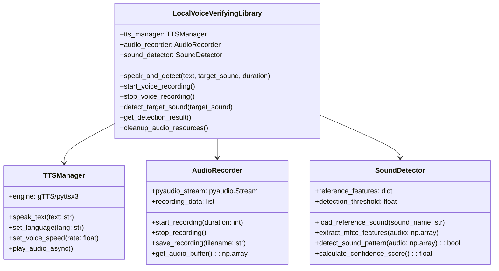
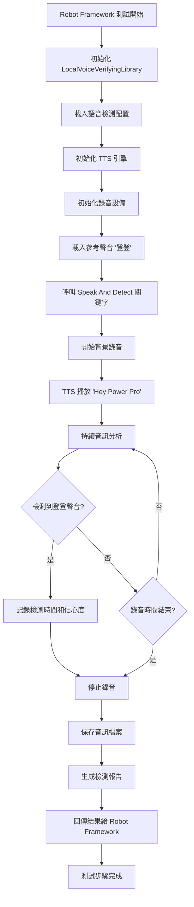
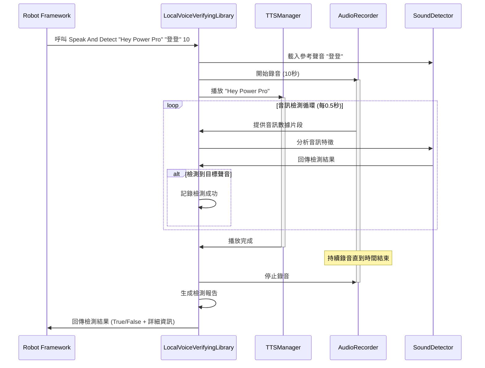

# 本地語音驗證系統規格文件

## 1. 專案概述

本模組實作一個本地語音驗證系統，整合於 Robot Framework 測試環境中，能夠：
1. 使用 Google TTS 發出 "Hey Power Pro" 音訊
2. 同時進行音訊錄製
3. 即時檢測錄音中是否包含"登登"聲音
4. 提供 Robot Framework 關鍵字介面

## 2. 系統架構

### 2.1 檔案結構

```
libraries/local_voice_verifying/
├── spec.md                    # 規格文件
├── todo.md                    # 任務清單
├── LocalVoiceVerifyingLibrary.py  # Robot Framework Library
├── voice_tts_manager.py       # TTS 管理模組
├── voice_audio_recorder.py    # 音訊錄製模組
├── voice_sound_detector.py    # 聲音檢測模組
├── voice_config.py           # 配置模組
├── requirements.txt          # 相依套件
├── audio_samples/            # 音訊樣本目錄
│   └── reference_sounds/     # 參考聲音檔案
├── logs/                     # 日誌檔案
└── test_data/               # 測試數據
```

### 2.2 Robot Framework 整合架構



### 2.3 系統流程圖



### 2.4 Robot Framework 測試循序圖



## 3. Robot Framework 關鍵字規格

### 3.1 主要關鍵字

#### Speak And Detect
```robot
Speak And Detect    ${text}    ${target_sound}    ${duration}=10
```
- **功能**: 播放指定文字並同時檢測目標聲音
- **參數**:
  - `text`: 要播放的文字內容
  - `target_sound`: 要檢測的目標聲音名稱
  - `duration`: 錄音持續時間(秒)，預設10秒
- **回傳**: 檢測結果 (True/False)

#### Start Voice Recording
```robot
Start Voice Recording    ${duration}=10
```
- **功能**: 開始音訊錄製
- **參數**: `duration`: 錄音時長
- **回傳**: 錄音狀態

#### Stop Voice Recording
```robot
Stop Voice Recording
```
- **功能**: 停止音訊錄製
- **回傳**: 錄音檔案路徑

#### Detect Target Sound
```robot
Detect Target Sound    ${target_sound}    ${audio_file}=None
```
- **功能**: 檢測指定聲音
- **參數**:
  - `target_sound`: 目標聲音名稱
  - `audio_file`: 音訊檔案路徑(可選，預設使用當前錄音)
- **回傳**: 檢測結果

#### Get Detection Result
```robot
Get Detection Result
```
- **功能**: 獲取最後一次檢測的詳細結果
- **回傳**: 包含信心度、檢測時間等詳細資訊的字典

#### Set Detection Threshold
```robot
Set Detection Threshold    ${threshold}
```
- **功能**: 設定聲音檢測閾值
- **參數**: `threshold`: 閾值 (0.0-1.0)

### 3.2 輔助關鍵字

#### Load Reference Sound
```robot
Load Reference Sound    ${sound_name}    ${file_path}
```
- **功能**: 載入參考聲音檔案
- **參數**:
  - `sound_name`: 聲音名稱標識
  - `file_path`: 參考聲音檔案路徑

#### Set TTS Language
```robot
Set TTS Language    ${language}=zh-TW
```
- **功能**: 設定 TTS 語言
- **參數**: `language`: 語言代碼

#### Set TTS Speed
```robot
Set TTS Speed    ${speed}=1.0
```
- **功能**: 設定 TTS 播放速度
- **參數**: `speed`: 播放速度倍率

#### Cleanup Audio Resources
```robot
Cleanup Audio Resources
```
- **功能**: 清理音訊資源
- **回傳**: 清理狀態

## 4. 技術規格

### 4.1 音訊處理規格
- **取樣率**: 16 kHz (語音優化)
- **聲道**: 單聲道 (Mono)
- **位元深度**: 16-bit
- **音訊格式**: WAV
- **緩衝區大小**: 1024 samples

### 4.2 TTS 規格
- **引擎**: Google TTS (gTTS) + 離線備援 (pyttsx3)
- **語言**: 支援 zh-TW, en-US
- **音質**: 標準品質
- **播放方式**: 非同步播放

### 4.3 聲音檢測規格
- **特徵提取**: MFCC (13維)
- **比對算法**: 動態時間規整 (DTW)
- **檢測閾值**: 0.75 (可調整)
- **分析窗口**: 1秒，重疊50%
- **最小檢測長度**: 0.5秒

### 4.4 效能需求
- **檢測延遲**: < 200ms
- **記憶體使用**: < 50MB
- **CPU 使用率**: < 30%
- **準確率**: > 90%

## 5. 錯誤處理規格

### 5.1 音訊設備錯誤
- **麥克風無法存取**: 回傳明確錯誤訊息
- **揚聲器無法存取**: 降級使用系統預設
- **音訊驅動問題**: 提供診斷資訊

### 5.2 TTS 錯誤
- **網路連線失敗**: 自動切換離線 TTS
- **語言不支援**: 使用預設語言並警告
- **文字轉語音失敗**: 記錄錯誤並跳過

### 5.3 檢測錯誤
- **參考聲音遺失**: 提示使用者載入
- **音訊格式不支援**: 自動轉換或報錯
- **記憶體不足**: 調整處理參數

## 6. 測試規格

### 6.1 Robot Framework 測試案例

```robot
*** Test Cases ***
Test Basic Voice Detection
    [Documentation]    測試基本語音檢測功能
    Speak And Detect    Hey Power Pro    登登    10
    ${result}=    Get Detection Result
    Should Be True    ${result['detected']}
    Should Be True    ${result['confidence']} > 0.7

Test TTS Without Detection
    [Documentation]    測試純 TTS 功能
    Start Voice Recording    5
    Sleep    1s
    Set TTS Language    zh-TW
    ${recording_file}=    Stop Voice Recording
    Should Exist    ${recording_file}
```

### 6.2 單元測試覆蓋
- TTSManager: 語音合成、語言設定、速度調整
- AudioRecorder: 錄音開始/停止、檔案保存
- SoundDetector: 特徵提取、相似度計算、閾值判斷
- Integration: 完整流程測試

### 6.3 效能基準測試
- 不同長度音訊的處理時間
- 不同背景噪音下的檢測準確率
- 長時間運行的記憶體穩定性
- 多次呼叫的資源清理效率

## 7. 部署與整合

### 7.1 Robot Framework 整合
- 將 library 加入 Robot Framework Library Path
- 在測試檔案中使用 `Library    libraries.local_voice_verifying.LocalVoiceVerifyingLibrary`
- 確保相依套件已正確安裝

### 7.2 相依性管理
- Python 3.8+
- Robot Framework 6.0+
- 音訊處理套件 (pyaudio, librosa)
- TTS 套件 (gTTS, pyttsx3)

### 7.3 平台支援
- **主要平台**: macOS (開發目標)
- **次要平台**: Windows, Linux
- **音訊權限**: 需要麥克風和揚聲器權限

## 8. 維護與擴展

### 8.1 日誌記錄
- 詳細的音訊處理日誌
- TTS 操作記錄
- 檢測結果歷史
- 錯誤追蹤日誌

### 8.2 配置管理
- 外部配置檔案支援
- 環境變數覆蓋
- 執行時參數調整

### 8.3 擴展性
- 支援多種 TTS 引擎
- 可插拔的檢測算法
- 自訂參考聲音庫
- 多語言檢測支援
