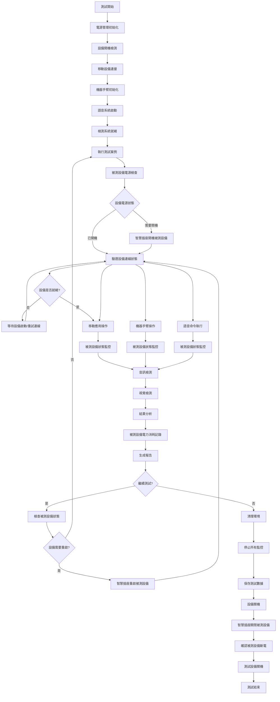
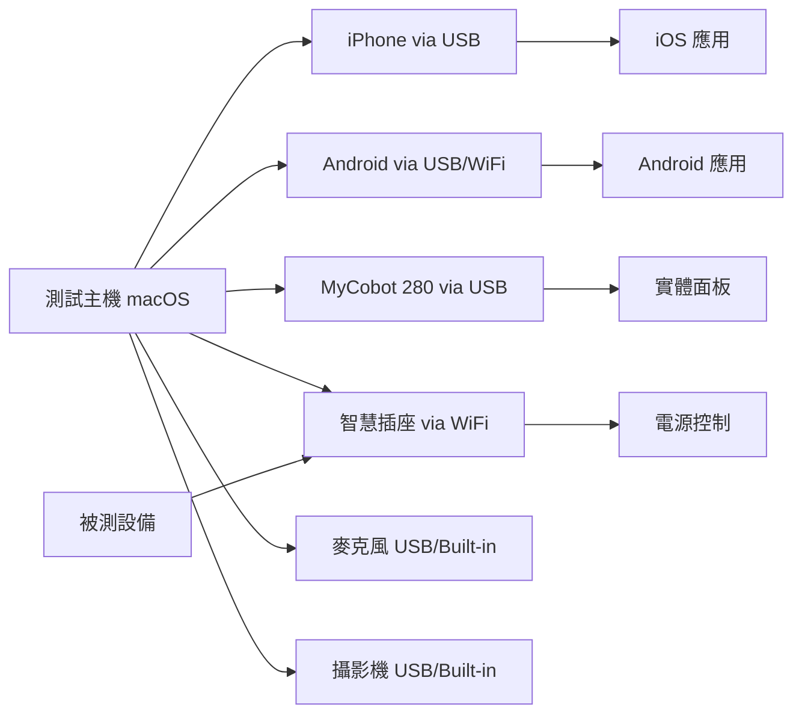

# Robot Framework 多平台自動化測試系統規格書 (spec.md)

## 專案概述 (Project Overview)

### 專案名稱
**Robot Framework Multi-Platform Automation Testing System**
多平台自動化測試系統

### 專案目標
建立一個基於 Robot Framework 的綜合性自動化測試平台，整合多種測試手段和檢測方式，實現對 iOS/Android 應用程式、硬體設備操作、語音控制和電源管理的全方位自動化測試。

### 專案範圍
1. **移動應用測試**: iOS 和 Android 應用程式自動化測試
2. **硬體操作測試**: MyCobot 280 機器手臂控制實體面板操作
3. **語音控制測試**: 本機語音識別和語音命令執行
4. **電源管理測試**: 智慧插座控制被測設備開關機
5. **多感官檢測**: 麥克風音訊檢測（發音與錄音判斷）和視覺影像判斷（靜態燈號檢測與動態角度變化分析）
6. **測試案例管理**: TestLink 整合管理測試案例與執行結果

### 測試案例管理策略
本專案將整合 **TestLink** 作為測試案例管理平台，實現以下功能：

#### TestLink 整合規劃
- **測試案例匯入**: 將 Robot Framework 測試案例自動同步至 TestLink
- **測試計劃管理**: 在 TestLink 中建立測試計劃並分配測試案例
- **執行結果回傳**: 自動化測試執行結果即時更新至 TestLink
- **測試報告整合**: TestLink 測試報告與 Robot Framework 報告聯動
- **缺陷追蹤**: 測試失敗案例自動建立缺陷單並關聯 TestLink

#### 測試案例分類架構
```
TestLink 專案結構:
├── 01_移動應用測試
│   ├── 01.1_iOS應用測試
│   │   ├── 功能測試
│   │   ├── 介面測試  
│   │   └── 效能測試
│   └── 01.2_Android應用測試
│       ├── 功能測試
│       ├── 相容性測試
│       └── 效能測試
├── 02_實體面板操作測試
│   ├── 02.1_按鈕操作測試
│   └── 02.2_狀態指示燈測試
├── 03_語音控制測試
│   ├── 03.1_語音識別測試
│   ├── 03.2_命令執行測試
│   └── 03.3_環境適應測試
├── 04_電源管理測試
│   ├── 04.1_智慧插座控制
│   ├── 04.2_被測設備電源管理
│   └── 04.3_電力消耗監控
├── 05_多感官檢測測試
│   ├── 05.1_音訊檢測測試
│   ├── 05.2_視覺檢測測試
│   └── 05.3_多模態整合測試
└── 06_整合測試
    ├── 06.1_端到端測試
    ├── 06.2_效能測試
    └── 06.3_穩定性測試

註：機器手臂作為測試工具，其功能驗證與校準存放在 libraries/ 目錄
    實際 TestLink 測試案例專注於被測產品的功能驗證
```

#### TestLink API 整合
- **REST API 連接**: 透過 TestLink REST API 實現雙向數據同步
- **自動化執行觸發**: 從 TestLink 觸發 Robot Framework 測試執行
- **即時狀態更新**: 測試執行狀態即時回傳至 TestLink
- **測試數據追蹤**: 測試覆蓋率、通過率等指標統計

## 系統架構 (System Architecture)

### 核心框架
- **主框架**: Robot Framework
- **程式語言**: Python 3.8+
- **作業系統**: macOS (主要), 支援 Windows/Linux
- **執行環境**: 本機 + 遠端設備網路

### 子系統模組

#### 1. 移動應用測試模組 (Mobile Testing Module)
```
mobile_testing/
├── ios_testing/
│   ├── ios_keywords.robot
│   ├── ios_locators.py
│   └── ios_test_library.py
├── android_testing/
│   ├── android_keywords.robot
│   ├── android_locators.py
│   └── android_test_library.py
└── common/
    ├── mobile_common_keywords.robot
    └── device_management.py
```

**技術棧**:
- iOS: WebDriverAgent + Appium
- Android: UIAutomator2 + Appium
- 設備管理: idevice + adb

#### 2. 機器手臂控制模組 (Robot Arm Control Module) - 測試工具
```
robot_arm_control/
├── mycobot_controller.py
├── arm_movements_library.py
├── panel_interaction_keywords.robot
├── calibration/
│   ├── coordinate_mapping.json
│   └── panel_coordinates.py
└── validation/                      # 工具驗證測試 (非 TestLink 案例)
    ├── arm_precision_test.py
    ├── safety_mechanism_test.py
    └── movement_validation.py
```

**技術棧**:
- 控制庫: pymycobot
- 座標系統: 3D 座標映射
- 視覺輔助: OpenCV 定位
- **RTSP 傳輸協議**: 必須使用 **UDP** (避免 TCP 461 Unsupported transport 錯誤)

**註**: 機器手臂作為測試執行工具，其精度校準、安全機制等驗證測試存放在 libraries/ 目錄下，不納入 TestLink 產品測試案例管理範圍。

#### 3. 語音控制模組 (Voice Control Module)
```
voice_control/
├── local_voice_verifying/          # 現有模組擴展
│   ├── LocalVoiceVerifyingLibrary.py
│   ├── voice_recognition_engine.py
│   └── command_processor.py
├── speech_commands/
│   ├── command_definitions.json
│   └── voice_command_keywords.robot
└── audio_processing/
    ├── noise_reduction.py
    └── audio_quality_check.py
```

**技術棧**:
- 語音識別: SpeechRecognition + Google Speech API
- 離線識別: Vosk + 英文模型
- 語音合成: 現有 gTTS + pyttsx3

#### 4. 電源管理模組 (Power Management Module)
```
power_management/
├── smart_socket_controller.py
├── power_keywords.robot
├── device_power_states.py
└── network_devices/
    ├── switchbot_controller.py
    └── generic_smart_socket.py
```

**技術棧**:
- 智慧插座: SwitchBot 智慧插座
- 網路協議: TCP/IP, HTTP API
- 狀態監控: Ping + 設備回應檢測

#### 6. TestLink 整合模組 (TestLink Integration Module)
```
testlink_integration/
├── testlink_connector.py
├── case_synchronizer.py
├── result_reporter.py
├── api_client/
│   ├── testlink_api.py
│   ├── auth_manager.py
│   └── data_mapper.py
├── config/
│   ├── testlink_config.json
│   └── mapping_rules.json
└── keywords/
    ├── testlink_keywords.robot
    └── sync_keywords.robot
```

**技術棧**:
- API 整合: TestLink XML-RPC API / REST API
- 資料同步: JSON/XML 格式轉換
- 認證管理: API Key + Session 管理
- 任務調度: APScheduler 定時同步

#### 7. 多感官檢測模組 (Multi-Sensory Detection Module)
```
detection_systems/
├── audio_detection/
│   ├── microphone_monitor.py
│   ├── sound_pattern_recognition.py
│   ├── audio_analysis_keywords.robot
│   ├── voice_interaction_engine.py          # 新增：語音互動引擎
│   └── audio_feedback_analyzer.py           # 新增：音訊回饋分析
├── visual_detection/
│   ├── camera_capture.py
│   ├── image_recognition.py
│   ├── screen_capture.py
│   ├── visual_verification_keywords.robot
│   ├── static_detection/                    # 新增：靜態檢測
│   │   ├── yolo_detector.py                # YOLO 物件檢測
│   │   ├── dashboard_light_detector.py     # 儀表板燈號檢測
│   │   └── led_status_analyzer.py          # LED 狀態分析
│   └── dynamic_detection/                  # 新增：動態檢測
│       ├── motion_tracker.py               # 運動追蹤
│       ├── angle_change_calculator.py      # 角度變化計算
│       └── frame_comparison_engine.py      # 幀間比較引擎
└── analysis/
    ├── result_correlation.py
    ├── detection_reports.py
    └── multi_modal_fusion.py               # 新增：多模態數據融合
```

**技術棧**:
- 音訊: PyAudio + librosa + 現有語音模組 + pyttsx3
- 靜態視覺: OpenCV + PIL + pytesseract + YOLOv8
- 動態視覺: OpenCV + numpy + scipy
- AI 識別: TensorFlow Lite + PyTorch (YOLO)
- 數據融合: scikit-learn + pandas

## 系統流程圖 (System Flow Diagram)



### 🔌 被測設備電源管理流程說明

上述流程圖已整合完整的被測設備電源管理機制，主要包含以下關鍵步驟：

#### 測試前準備
- **H1-H5**: 測試開始前檢查被測設備電源狀態
  - 自動檢測設備是否已開機
  - 必要時透過智慧插座開機被測設備
  - 驗證設備網路連線與就緒狀態

#### 測試執行期間
- **I1, J1, K1**: 持續監控被測設備狀態
  - 即時監控設備電力消耗
  - 檢測設備回應性與穩定性
  - 記錄異常狀況與性能數據

#### 測試循環管理
- **P1-P3**: 測試案例間的設備狀態管理
  - 檢查設備是否需要重啟恢復
  - 自動執行設備重啟操作
  - 確保每個測試案例的設備狀態一致

#### 測試結束清理
- **Q1-R3**: 完整的設備關機與清理流程
  - 停止所有監控與資料收集
  - 優雅關閉被測設備 (透過智慧插座)
  - 確認設備完全斷電與測試環境清理

此設計確保了測試過程中被測設備的電源狀態得到完整管理，提升測試可靠性與環境一致性。

## 詳細功能規格 (Detailed Functional Specifications)

### 1. 移動應用測試功能

#### iOS 測試能力
- **應用安裝/卸載**: 透過 Xcode + iOS Deploy 自動化安裝測試應用
- **UI 元素操作**: 點擊、滑動、輸入文字、手勢操作
- **應用狀態管理**: 前台/後台切換、應用重啟、記憶體管理
- **網路狀態模擬**: WiFi/4G/5G 切換、網路中斷模擬
- **設備功能測試**: 攝影機、GPS、推播通知、Touch ID/Face ID

#### Android 測試能力
- **應用管理**: APK 安裝/卸載、應用權限管理
- **系統互動**: 系統設定修改、通知欄操作
- **硬體功能**: 感測器測試、藍牙/NFC 測試
- **效能監控**: CPU/記憶體使用率、電池消耗

#### 關鍵字範例
```robotframework
*** Keywords ***
Install Mobile App
    [Arguments]    ${platform}    ${app_path}
    IF    '${platform}' == 'ios'
        Install iOS App    ${app_path}
    ELSE
        Install Android App    ${app_path}
    END

Launch App And Verify
    [Arguments]    ${app_id}    ${expected_screen}
    Launch Application    ${app_id}
    Wait Until Screen Contains    ${expected_screen}
    Capture Screenshot
```

### 2. 機器手臂控制功能 (測試工具)

#### MyCobot 280 操作能力 (作為測試執行工具)
- **基本運動**: 6軸關節精確控制、直線/圓弧路徑規劃
- **座標系統**: 基座座標、工具座標、關節座標轉換
- **安全機制**: 碰撞檢測、限位保護、急停功能
- **精度校準**: 視覺輔助定位、座標補償

#### 實體面板操作 (針對被測設備)
- **按鈕操作**: 精確點擊、長按、連續點擊
- **狀態檢測**: 按鈕狀態、LED 指示燈檢測

**註**: 機器手臂本身的功能驗證 (精度測試、校準驗證、安全機制測試) 屬於工具驗證範疇，存放在 `libraries/robot_arm_control/validation/` 目錄，不列入 TestLink 產品測試案例。TestLink 中的實體面板操作測試專注於驗證被測設備的面板功能是否正常。

#### 關鍵字範例
```robotframework
*** Keywords ***
Move Arm To Panel Position
    [Arguments]    ${panel_name}    ${button_name}
    ${coordinates}=    Get Panel Coordinates    ${panel_name}    ${button_name}
    Move To Coordinates    ${coordinates}
    Verify Arm Position    ${coordinates}

Press Physical Button
    [Arguments]    ${button_coordinates}    ${press_duration}=1
    Move To Coordinates    ${button_coordinates}
    Press Down    ${press_duration}
    Move To Safe Position
    Verify Button State Changed
```

### 3. 語音控制功能

#### 語音識別能力
- **語言支援**: 英文 (English)
- **環境適應**: 噪音消除、回音抑制
- **命令識別**: 預定義命令集、自然語言理解
- **即時回饋**: 語音識別結果即時顯示

#### 語音命令系統
- **設備控制**: "power on", "power off", "restart", "volume up"
- **應用操作**: "open app", "click button", "input text"
- **測試控制**: "start test", "pause test", "stop test"
- **狀態查詢**: "check status", "show results", "generate report"

#### 關鍵字範例
```robotframework
*** Keywords ***
Execute Voice Command
    [Arguments]    ${command_text}    ${timeout}=10
    Start Voice Recognition
    Wait For Command    ${command_text}    ${timeout}
    ${result}=    Process Voice Command    ${command_text}
    Verify Command Execution    ${result}

Voice Control Device
    [Arguments]    ${device_name}    ${action}
    ${voice_command}=    Generate Voice Command    ${device_name}    ${action}
    Execute Voice Command    ${voice_command}
    Verify Device Response    ${device_name}    ${action}
```

### 4. 電源管理功能

#### 智慧插座控制
- **設備支援**: SwitchBot 智慧插座
- **網路通訊**: TCP/IP、HTTP REST API、MQTT
- **狀態監控**: 即時功率監測、開關狀態檢測
- **排程控制**: 定時開關、延遲執行

#### 設備電源管理
- **開機檢測**: 網路 Ping、設備回應檢測
- **關機確認**: 優雅關機、強制斷電
- **重啟循環**: 自動重啟測試、穩定性驗證
- **電源狀態記錄**: 開關機時間、電力消耗統計

#### 關鍵字範例
```robotframework
*** Keywords ***
Power Control Device
    [Arguments]    ${device_name}    ${action}    ${wait_time}=30
    ${socket_id}=    Get Socket ID    ${device_name}
    IF    '${action}' == 'ON'
        Turn On Smart Socket    ${socket_id}
        Wait Until Device Online    ${device_name}    ${wait_time}
    ELSE
        Turn Off Smart Socket    ${socket_id}
        Wait Until Device Offline    ${device_name}    ${wait_time}
    END

Verify Device Power State
    [Arguments]    ${device_name}    ${expected_state}
    ${actual_state}=    Check Device Online Status    ${device_name}
    Should Be Equal    ${actual_state}    ${expected_state}

# 被測設備電源管理專用關鍵字
Check Target Device Power Status
    [Documentation]    檢查被測設備電源狀態 (對應流程 H1-H2)
    [Arguments]    ${target_device}
    ${power_status}=    Get Device Power Status    ${target_device}
    ${connection_status}=    Check Device Connection    ${target_device}
    RETURN    ${power_status}    ${connection_status}

Power On Target Device If Needed
    [Documentation]    必要時開機被測設備 (對應流程 H3)
    [Arguments]    ${target_device}    ${max_retry}=3
    FOR    ${i}    IN RANGE    ${max_retry}
        ${status}=    Check Target Device Power Status    ${target_device}
        IF    '${status}' == 'OFF'
            Log    開機被測設備: ${target_device}
            Power Control Device    ${target_device}    ON
            Sleep    10s
        ELSE
            Log    被測設備已開機: ${target_device}
            BREAK
        END
    END

Verify Target Device Ready
    [Documentation]    驗證被測設備就緒狀態 (對應流程 H4-H5)
    [Arguments]    ${target_device}    ${timeout}=60s
    Wait Until Keyword Succeeds    ${timeout}    5s    
    ...    Check Device Connection    ${target_device}
    Wait Until Keyword Succeeds    ${timeout}    5s    
    ...    Verify Device Response    ${target_device}    ping
    Log    被測設備 ${target_device} 已就緒

Monitor Target Device During Test
    [Documentation]    測試期間監控被測設備 (對應流程 I1, J1, K1)
    [Arguments]    ${target_device}    ${monitoring_interval}=5s
    Start Power Monitoring    ${target_device}    ${monitoring_interval}
    Start Connection Monitoring    ${target_device}    ${monitoring_interval}
    Log    開始監控被測設備: ${target_device}

Record Target Device Power Consumption
    [Documentation]    記錄被測設備電力消耗 (對應流程 N1)
    [Arguments]    ${target_device}
    ${power_data}=    Get Power Consumption Data    ${target_device}
    Log    被測設備電力消耗: ${power_data}
    Save Power Data To Report    ${target_device}    ${power_data}

Check If Target Device Needs Restart
    [Documentation]    檢查被測設備是否需要重啟 (對應流程 P1-P2)
    [Arguments]    ${target_device}
    ${response_time}=    Get Device Response Time    ${target_device}
    ${memory_usage}=    Get Device Memory Usage    ${target_device}
    ${needs_restart}=    Evaluate Device Health    ${response_time}    ${memory_usage}
    RETURN    ${needs_restart}

Restart Target Device If Needed
    [Documentation]    必要時重啟被測設備 (對應流程 P3)
    [Arguments]    ${target_device}
    ${needs_restart}=    Check If Target Device Needs Restart    ${target_device}
    IF    ${needs_restart}
        Log    重啟被測設備以恢復性能: ${target_device}
        Power Control Device    ${target_device}    OFF
        Sleep    5s
        Power Control Device    ${target_device}    ON
        Verify Target Device Ready    ${target_device}
    END

Graceful Shutdown Target Device
    [Documentation]    優雅關閉被測設備 (對應流程 R1-R2)
    [Arguments]    ${target_device}
    Stop All Monitoring    ${target_device}
    Log    正在關閉被測設備: ${target_device}
    Power Control Device    ${target_device}    OFF
    Wait Until Device Offline    ${target_device}    timeout=30s
    Log    被測設備已完全關閉: ${target_device}
```

### 6. TestLink 整合功能

#### 測試案例管理能力
- **案例同步**: Robot Framework 測試案例自動匯入 TestLink
- **計劃建立**: 自動建立測試計劃並關聯測試案例
- **執行追蹤**: 即時追蹤測試執行狀態與進度
- **結果回報**: 測試結果自動更新至 TestLink

#### 測試數據分析
- **覆蓋率統計**: 測試案例覆蓋率分析與報告
- **通過率追蹤**: 測試通過率趨勢分析
- **缺陷關聯**: 失敗案例自動關聯缺陷追蹤系統
- **歷史比較**: 測試結果歷史數據比較分析

#### 關鍵字範例
```robotframework
*** Keywords ***
Sync Test Cases To TestLink
    [Arguments]    ${project_id}    ${test_suite_path}
    Connect To TestLink    ${TESTLINK_URL}    ${API_KEY}
    ${test_cases}=    Parse Robot Framework Suite    ${test_suite_path}
    FOR    ${test_case}    IN    @{test_cases}
        Create TestLink Test Case    ${project_id}    ${test_case}
    END
    Log    Test cases synchronized successfully

Execute TestLink Test Plan
    [Arguments]    ${test_plan_id}    ${build_id}
    ${test_cases}=    Get TestLink Test Cases    ${test_plan_id}
    FOR    ${test_case}    IN    @{test_cases}
        ${result}=    Execute Robot Framework Test    ${test_case.robot_file}
        Report Test Result To TestLink    ${test_case.id}    ${result}    ${build_id}
    END

Update TestLink Test Result
    [Arguments]    ${test_case_id}    ${execution_id}    ${result}    ${notes}
    ${status}=    Convert Robot Result To TestLink    ${result}
    Update Test Execution    ${test_case_id}    ${execution_id}    ${status}    ${notes}
    IF    '${result}' == 'FAIL'
        Create Bug Report    ${test_case_id}    ${notes}
    END
```

### 7. 多感官檢測功能

#### 音訊檢測系統 (雙向音訊互動)

##### 麥克風發音功能 (Audio Output)
- **TTS 語音合成**:
  - 多語言支援 (中文、英文、日文)
  - 語音參數調整 (語速、音調、音量)
  - 自定義發音詞典與語音優化
  - 即時語音合成與播放
- **測試音效產生**:
  - 標準測試音頻 (1kHz, 440Hz, 白噪音)
  - 警報聲、提示音、通知音產生
  - 多頻率混合音效合成
  - 音量動態控制與淡入淡出
- **音訊輸出管理**:
  - 多聲道輸出控制
  - 音訊設備自動切換
  - 輸出延遲補償
  - 音效優先級管理

##### 麥克風錄音與判斷功能 (Audio Input & Analysis)
- **即時錄音系統**:
  - 高品質音訊擷取 (44.1kHz/48kHz, 16/24bit)
  - 背景音訊持續監控
  - 觸發式錄音 (音量閾值、關鍵字啟動)
  - 多軌道同時錄製
- **語音識別與分析**:
  - ASR (Automatic Speech Recognition) 語音轉文字
  - 關鍵字檢測與語音命令識別
  - 語音情感分析與語調檢測
  - 語音品質評估 (清晰度、完整性)
- **音訊信號處理**:
  - 噪音抑制與回音消除
  - 頻譜分析與頻率域處理
  - 音量正規化與動態範圍控制
  - 音訊特徵提取 (MFCC, 頻譜質心)
- **環境音檢測**:
  - 機器運轉聲模式識別
  - 警報聲、蜂鳴聲自動檢測
  - 異常音效模式分析
  - 音訊事件時間戳記錄

##### 音訊回饋驗證系統
- **發音後回應檢測**:
  - 發音指令執行後的設備音訊回應監控
  - 音訊回饋延遲時間測量
  - 回應音效正確性驗證
  - 多輪對話式互動測試
- **音訊品質評估**:
  - THD (總諧波失真) 測量
  - SNR (信噪比) 分析
  - 音訊一致性檢測
  - 頻率響應特性分析

#### 視覺檢測系統 (靜態與動態檢測)

##### 靜態影像檢測 (Static Image Detection)

###### YOLO 燈號檢測系統
- **YOLOv8 深度學習模型**:
  - **多類別燈號訓練**: 紅燈、綠燈、藍燈、黃燈、白燈分類
  - **燈號狀態檢測**: 亮燈/熄燈/閃爍/半亮狀態識別
  - **多燈號同時檢測**: 單一影像中檢測多個不同燈號
  - **自定義燈號模型**: 支援特定設備燈號的客製化訓練
- **燈號檢測精度優化**:
  - **ROI 區域設定**: 針對特定區域進行高精度檢測
  - **信心度閾值調整**: 動態調整檢測敏感度
  - **邊界框精確定位**: 像素級燈號位置定位
  - **光照條件適應**: 不同光照環境下的穩定檢測
- **燈號狀態分析**:
  - **顏色空間轉換**: RGB、HSV、LAB 多色彩空間分析
  - **亮度測量**: 燈號亮度數值化測量
  - **閃爍頻率檢測**: 自動測量閃爍週期與頻率
  - **燈號組合邏輯**: 多燈號狀態組合的邏輯判斷

###### 傳統影像檢測
- **螢幕擷取**: 設備螢幕即時擷取、多螢幕監控支援
- **OCR 文字識別**: 
  - 多語言文字識別 (中文、英文、數字)
  - 儀表數值讀取與數值驗證
  - UI 文字內容比對與狀態確認
- **圖標與符號檢測**:
  - 模板匹配圖標識別
  - 幾何形狀檢測 (圓形、方形、三角形)
  - 符號方向與角度識別
- **色彩變化檢測**:
  - 區域色彩變化監控
  - 色溫變化檢測
  - 色彩飽和度分析

##### 動態影像檢測 (Dynamic Motion Detection)

###### 標記中心點追蹤系統
- **高頻影像擷取**:
  - **幀率優化**: 30-120 FPS 高頻率影像擷取
  - **多攝影機同步**: 多角度同時擷取與時間同步
  - **影像緩衝管理**: 大容量影像緩衝區管理
  - **即時處理**: 影像擷取與處理的即時性保證
- **標記檢測與追蹤**:
  - **標記識別演算法**: 
    - 圓形標記檢測 (Hough Circle Detection)
    - 特徵點檢測 (SIFT, ORB, AKAZE)
    - 顏色標記檢測 (色彩空間過濾)
    - ArUco 標記檢測與解碼
  - **中心點計算**: 
    - 重心計算演算法
    - 亞像素級精度定位
    - 多邊形質心計算
    - 橢圓擬合中心點提取
  - **追蹤演算法**:
    - KCF (Kernelized Correlation Filter) 追蹤器
    - CSRT (Channel and Spatial Reliability Tracker)
    - MOSSE (Minimum Output Sum of Squared Error)
    - 卡爾曼濾波器軌跡預測

###### 角度變化計算與分析
- **角度測量系統**:
  - **相對角度計算**:
    - 標記中心點相對於馬達中心的角度
    - 標記中心點相對於影像中心的角度
    - 標記中心點相對於固定參考點的角度
  - **角度變化量測量**:
    - 幀間角度差值計算
    - 累積角度變化統計
    - 旋轉方向判斷 (順時針/逆時針)
    - 角度變化率 (角速度) 計算
- **運動參數分析**:
  - **線性運動檢測**:
    - X-Y 座標位移追蹤
    - 移動距離與方向計算
    - 移動速度向量分析
  - **旋轉運動分析**:
    - 旋轉角速度計算
    - 旋轉加速度測量
    - 旋轉週期與頻率分析
    - 旋轉軌跡半徑測量
- **軌跡記錄與可視化**:
  - **軌跡數據記錄**:
    - 時間戳與座標對應記錄
    - 軌跡點密度控制
    - 軌跡數據格式化輸出 (CSV, JSON)
  - **軌跡可視化**:
    - 即時軌跡繪製疊加
    - 軌跡熱力圖生成
    - 運動向量可視化
    - 軌跡統計圖表生成

###### 進階動態檢測
- **多目標同時追蹤**:
  - 多標記物同時追蹤與ID管理
  - 標記遮擋處理與恢復追蹤
  - 多目標軌跡關聯與分析
- **運動模式識別**:
  - 週期性運動檢測
  - 異常運動模式識別
  - 運動狀態分類 (靜止/緩慢/快速)
- **運動預測與補償**:
  - 軌跡預測演算法
  - 運動模糊補償
  - 影像抖動校正

#### 攝影機監控系統
- **實體環境監控**: 測試環境狀態持續監控
- **設備狀態觀察**: 被測設備外觀狀態檢測
- **異常狀況記錄**: 自動捕捉異常事件並記錄

#### 關鍵字範例
```robotframework
*** Keywords ***
# =================== 音訊發音功能關鍵字 ===================
Generate Custom TTS Audio
    [Documentation]    生成自定義語音合成音訊
    [Arguments]    ${text}    ${language}=zh-TW    ${speed}=1.0    ${pitch}=1.0    ${volume}=0.8
    ${audio_config}=    Create Dictionary    
    ...    language=${language}    
    ...    speed=${speed}    
    ...    pitch=${pitch}    
    ...    volume=${volume}
    ${audio_file}=    TTS Engine Generate    ${text}    ${audio_config}
    Play Audio File    ${audio_file}
    RETURN    ${audio_file}

Generate Test Tone Signal
    [Documentation]    產生標準測試音頻信號
    [Arguments]    ${frequency}=1000    ${duration}=3.0    ${amplitude}=0.5    ${waveform}=sine
    ${tone_config}=    Create Dictionary    
    ...    frequency=${frequency}    
    ...    duration=${duration}    
    ...    amplitude=${amplitude}    
    ...    waveform=${waveform}
    ${tone_signal}=    Generate Tone    ${tone_config}
    Play Audio Signal    ${tone_signal}
    RETURN    ${tone_signal}

Play Multi Language Audio Test
    [Documentation]    多語言語音測試
    [Arguments]    @{test_phrases}
    FOR    ${phrase_config}    IN    @{test_phrases}
        ${text}=    Get From Dictionary    ${phrase_config}    text
        ${lang}=    Get From Dictionary    ${phrase_config}    language
        ${expected_response}=    Get From Dictionary    ${phrase_config}    expected_response
        
        Generate Custom TTS Audio    ${text}    ${lang}
        Sleep    2s    # 等待設備回應
        
        ${response_audio}=    Record Audio Response    duration=3s
        ${recognition_result}=    Audio Speech Recognition    ${response_audio}    ${lang}
        Should Contain    ${recognition_result}    ${expected_response}
        Log    Language: ${lang}, Recognition: ${recognition_result}
    END

# =================== 音訊錄音與分析關鍵字 ===================
Start High Quality Audio Recording
    [Documentation]    啟動高品質音訊錄製
    [Arguments]    ${sample_rate}=48000    ${bit_depth}=24    ${channels}=2    ${duration}=None
    ${recording_config}=    Create Dictionary    
    ...    sample_rate=${sample_rate}    
    ...    bit_depth=${bit_depth}    
    ...    channels=${channels}    
    ...    duration=${duration}
    ${recording_id}=    Audio Recorder Start    ${recording_config}
    Set Test Variable    ${CURRENT_RECORDING_ID}    ${recording_id}
    RETURN    ${recording_id}

Analyze Audio Frequency Spectrum
    [Documentation]    分析音訊頻譜特性
    [Arguments]    ${audio_file}    ${target_frequency}=None
    ${spectrum_data}=    Audio FFT Analysis    ${audio_file}
    ${dominant_frequency}=    Get Dominant Frequency    ${spectrum_data}
    ${frequency_distribution}=    Get Frequency Distribution    ${spectrum_data}
    ${noise_floor}=    Calculate Noise Floor    ${spectrum_data}
    
    IF    ${target_frequency} is not None
        ${frequency_accuracy}=    Evaluate    abs(${dominant_frequency} - ${target_frequency})
        Should Be True    ${frequency_accuracy} < 50    # 50Hz 容許誤差
        Log    Target: ${target_frequency}Hz, Detected: ${dominant_frequency}Hz, Error: ${frequency_accuracy}Hz
    END
    
    RETURN    ${spectrum_data}

Detect Environmental Sound Patterns
    [Documentation]    環境音模式檢測
    [Arguments]    ${monitoring_duration}=30    ${sound_patterns}
    Start Continuous Audio Monitoring    duration=${monitoring_duration}
    
    FOR    ${pattern_name}    ${pattern_config}    IN    &{sound_patterns}
        ${detection_result}=    Wait For Sound Pattern    
        ...    pattern_name=${pattern_name}    
        ...    frequency_range=${pattern_config}[frequency_range]    
        ...    amplitude_threshold=${pattern_config}[amplitude_threshold]    
        ...    timeout=${monitoring_duration}
        
        IF    ${detection_result}[detected]
            Log    Environmental sound detected: ${pattern_name} at ${detection_result}[timestamp]
            ${audio_clip}=    Extract Audio Segment    
            ...    start_time=${detection_result}[start_time]    
            ...    duration=${detection_result}[duration]
            Save Audio Clip    ${audio_clip}    pattern_${pattern_name}.wav
        ELSE
            Log    Warning: Expected sound pattern '${pattern_name}' not detected
        END
    END
    
    Stop Audio Monitoring

# =================== YOLO 燈號檢測關鍵字 ===================
Initialize YOLO Light Detection Model
    [Documentation]    初始化 YOLO 燈號檢測模型
    [Arguments]    ${model_path}=models/dashboard_lights_yolov8.pt    ${confidence_threshold}=0.7
    ${yolo_model}=    Load YOLO Model    ${model_path}
    Set YOLO Confidence Threshold    ${yolo_model}    ${confidence_threshold}
    Set Global Variable    ${YOLO_LIGHT_MODEL}    ${yolo_model}
    RETURN    ${yolo_model}

Detect Multi Color LED Status
    [Documentation]    檢測多色 LED 燈號狀態
    [Arguments]    ${image_source}    ${roi_coordinates}=None    ${expected_colors}
    ${raw_image}=    Capture Image    ${image_source}
    
    IF    ${roi_coordinates} is not None
        ${processed_image}=    Extract ROI    ${raw_image}    ${roi_coordinates}
    ELSE
        ${processed_image}=    Set Variable    ${raw_image}
    END
    
    ${detection_results}=    YOLO Detect    ${YOLO_LIGHT_MODEL}    ${processed_image}
    ${led_status_results}=    Create Dictionary
    
    FOR    ${expected_color}    IN    @{expected_colors}
        ${color_detections}=    Filter Detections By Color    ${detection_results}    ${expected_color}
        
        IF    len(${color_detections}) > 0
            ${led_state}=    Analyze LED State    ${color_detections}[0]
            ${brightness}=    Calculate LED Brightness    ${color_detections}[0]
            ${blink_frequency}=    Detect Blink Pattern    ${color_detections}[0]    duration=3s
            
            ${led_info}=    Create Dictionary    
            ...    state=${led_state}    
            ...    brightness=${brightness}    
            ...    blink_frequency=${blink_frequency}    
            ...    confidence=${color_detections}[0][confidence]
            
            Set To Dictionary    ${led_status_results}    ${expected_color}    ${led_info}
            Log    ${expected_color} LED: State=${led_state}, Brightness=${brightness}, Confidence=${color_detections}[0][confidence]
        ELSE
            Set To Dictionary    ${led_status_results}    ${expected_color}    ${{{'state': 'not_detected', 'confidence': 0.0}}}
            Log    Warning: ${expected_color} LED not detected
        END
    END
    
    RETURN    ${led_status_results}

Monitor LED Status Changes
    [Documentation]    監控 LED 狀態變化
    [Arguments]    ${monitoring_duration}=60    ${led_configs}    ${change_threshold}=0.1
    ${start_time}=    Get Current Time
    ${status_history}=    Create List
    
    WHILE    True
        ${current_image}=    Capture Image    dashboard_camera
        ${current_status}=    Detect Multi Color LED Status    ${current_image}    expected_colors=${led_configs}[colors]
        
        ${timestamp}=    Get Current Time
        ${status_entry}=    Create Dictionary    timestamp=${timestamp}    status=${current_status}
        Append To List    ${status_history}    ${status_entry}
        
        # 檢測狀態變化
        IF    len(${status_history}) > 1
            ${previous_status}=    Get From List    ${status_history}    -2
            ${changes_detected}=    Compare LED Status    ${previous_status}[status]    ${current_status}    ${change_threshold}
            
            IF    ${changes_detected}[has_changes]
                Log    LED status changes detected: ${changes_detected}[change_details]
                Create Status Change Report    ${changes_detected}    ${timestamp}
            END
        END
        
        ${elapsed_time}=    Calculate Elapsed Time    ${start_time}
        IF    ${elapsed_time} >= ${monitoring_duration}
            BREAK
        END
        Sleep    0.5s    # 500ms 檢測間隔
    END
    
    RETURN    ${status_history}

# =================== 面板燈號雙重驗證關鍵字 ===================
Verify Panel Light Dual Check
    [Documentation]    雙重驗證面板按鈕狀態 (YOLO + ROI)
    [Arguments]    ${button_id}    ${expected_state}    ${mode}=loose
    
    # 1. 執行 YOLO 偵測並獲取影像
    ${image_base64}=    Scan And Detect    ${button_id}    return_image=True
    
    # 2. 驗證 YOLO 結果
    ${yolo_result}=    Check YOLO Detection    ${button_id}    ${expected_state}
    
    # 3. 執行 ROI 影像分析 (使用回傳影像)
    ${roi_result}=    Analyze ROI From Image    ${image_base64}    ${button_id}
    
    # 4. 驗證 ROI 結果 (顏色/亮度)
    ${roi_pass}=    Check ROI Status    ${roi_result}    ${expected_state}
    
    # 5. 綜合判定
    IF    '${mode}' == 'strict'
        Should Be True    ${yolo_result} and ${roi_pass}
    ELSE
        Should Be True    ${yolo_result} or ${roi_pass}
    END
    
    RETURN    ${True}

# =================== 動態角度變化檢測關鍵字 ===================
Initialize Marker Tracking System
    [Documentation]    初始化標記追蹤系統
    [Arguments]    ${camera_source}    ${tracker_type}=CSRT    ${marker_configs}
    ${tracking_system}=    Create Dictionary    
    ...    camera_source=${camera_source}    
    ...    tracker_type=${tracker_type}    
    ...    active_trackers=${{{}}}
    
    FOR    ${marker_name}    ${marker_config}    IN    &{marker_configs}
        ${initial_frame}=    Capture Camera Image    ${camera_source}
        ${marker_bbox}=    Detect Initial Marker    ${initial_frame}    ${marker_config}
        
        IF    ${marker_bbox} is not None
            ${tracker}=    Initialize Tracker    ${tracker_type}    ${initial_frame}    ${marker_bbox}
            Set To Dictionary    ${tracking_system}[active_trackers]    ${marker_name}    ${tracker}
            Log    Marker '${marker_name}' tracking initialized: ${marker_bbox}
        ELSE
            Log    Error: Marker '${marker_name}' not found in initial frame
        END
    END
    
    Set Global Variable    ${TRACKING_SYSTEM}    ${tracking_system}
    RETURN    ${tracking_system}

Track Multi Marker Rotation
    [Documentation]    追蹤多個標記的旋轉運動
    [Arguments]    ${tracking_duration}=30    ${sampling_rate}=30    ${reference_center}
    ${tracking_data}=    Create Dictionary
    ${start_time}=    Get Current Time
    ${frame_interval}=    Evaluate    1.0 / ${sampling_rate}
    
    # 為每個追蹤中的標記初始化數據記錄
    FOR    ${marker_name}    IN    @{TRACKING_SYSTEM}[active_trackers]
        Set To Dictionary    ${tracking_data}    ${marker_name}    Create List
    END
    
    WHILE    True
        ${current_frame}=    Capture Camera Image    ${TRACKING_SYSTEM}[camera_source]
        ${current_timestamp}=    Get Current Time
        
        FOR    ${marker_name}    ${tracker}    IN    &{TRACKING_SYSTEM}[active_trackers]
            ${tracking_success}    ${bbox}=    Update Tracker    ${tracker}    ${current_frame}
            
            IF    ${tracking_success}
                ${center_point}=    Calculate Bbox Center    ${bbox}
                ${angle_to_reference}=    Calculate Angle To Point    ${center_point}    ${reference_center}
                
                ${data_point}=    Create Dictionary    
                ...    timestamp=${current_timestamp}    
                ...    center_point=${center_point}    
                ...    bbox=${bbox}    
                ...    angle=${angle_to_reference}
                
                ${marker_history}=    Get From Dictionary    ${tracking_data}    ${marker_name}
                Append To List    ${marker_history}    ${data_point}
                
                # 計算角度變化 (如果有前一幀數據)
                IF    len(${marker_history}) > 1
                    ${previous_point}=    Get From List    ${marker_history}    -2
                    ${angle_change}=    Evaluate    ${angle_to_reference} - ${previous_point}[angle]
                    ${angular_velocity}=    Calculate Angular Velocity    ${angle_change}    ${frame_interval}
                    
                    Set To Dictionary    ${data_point}    angle_change    ${angle_change}
                    Set To Dictionary    ${data_point}    angular_velocity    ${angular_velocity}
                    
                    Log    ${marker_name}: Angle=${angle_to_reference:.2f}°, Change=${angle_change:.2f}°, AngVel=${angular_velocity:.2f}°/s
                END
            ELSE
                Log    Warning: Tracking lost for marker '${marker_name}'
                # 嘗試重新初始化追蹤
                ${redetection_result}=    Attempt Marker Redetection    ${current_frame}    ${marker_name}
                IF    ${redetection_result}[success]
                    ${new_tracker}=    Initialize Tracker    ${TRACKING_SYSTEM}[tracker_type]    ${current_frame}    ${redetection_result}[bbox]
                    Set To Dictionary    ${TRACKING_SYSTEM}[active_trackers]    ${marker_name}    ${new_tracker}
                    Log    Marker '${marker_name}' tracking reinitialized
                END
            END
        END
        
        ${elapsed_time}=    Calculate Elapsed Time    ${start_time}
        IF    ${elapsed_time} >= ${tracking_duration}
            BREAK
        END
        Sleep    ${frame_interval}s
    END
    
    RETURN    ${tracking_data}

Analyze Rotation Patterns
    [Documentation]    分析旋轉模式與統計
    [Arguments]    ${tracking_data}    ${analysis_config}
    ${analysis_results}=    Create Dictionary
    
    FOR    ${marker_name}    ${marker_history}    IN    &{tracking_data}
        IF    len(${marker_history}) < 2
            Log    Warning: Insufficient data for marker '${marker_name}' analysis
            CONTINUE
        END
        
        # 基本統計分析
        ${angle_changes}=    Extract Angle Changes    ${marker_history}
        ${angular_velocities}=    Extract Angular Velocities    ${marker_history}
        
        ${total_rotation}=    Calculate Total Rotation    ${angle_changes}
        ${average_angular_velocity}=    Calculate Average    ${angular_velocities}
        ${max_angular_velocity}=    Calculate Maximum    ${angular_velocities}
        ${rotation_direction}=    Determine Primary Rotation Direction    ${angle_changes}
        
        # 進階分析
        ${rotation_periods}=    Detect Rotation Periods    ${marker_history}    ${analysis_config}[period_threshold]
        ${rotation_smoothness}=    Calculate Rotation Smoothness    ${angular_velocities}
        ${acceleration_analysis}=    Analyze Angular Acceleration    ${angular_velocities}
        
        ${marker_analysis}=    Create Dictionary    
        ...    total_rotation=${total_rotation}    
        ...    average_angular_velocity=${average_angular_velocity}    
        ...    max_angular_velocity=${max_angular_velocity}    
        ...    rotation_direction=${rotation_direction}    
        ...    rotation_periods=${rotation_periods}    
        ...    rotation_smoothness=${rotation_smoothness}    
        ...    acceleration_analysis=${acceleration_analysis}
        
        Set To Dictionary    ${analysis_results}    ${marker_name}    ${marker_analysis}
        
        Log    Marker ${marker_name} Analysis:
        Log    - Total Rotation: ${total_rotation:.2f}°
        Log    - Avg Angular Velocity: ${average_angular_velocity:.2f}°/s
        Log    - Primary Direction: ${rotation_direction}
        Log    - Rotation Periods: ${len(${rotation_periods})}
        Log    - Smoothness Score: ${rotation_smoothness:.3f}
    END
    
    RETURN    ${analysis_results}

# =================== 多模態整合檢測關鍵字 ===================
Execute Multi Modal Test Sequence
    [Documentation]    執行多模態測試序列
    [Arguments]    ${test_sequence}    ${synchronization_config}
    ${test_results}=    Create List
    
    FOR    ${step_index}    ${test_step}    IN ENUMERATE    @{test_sequence}
        Log    Executing test step ${step_index + 1}: ${test_step}[name]
        
        # 同步啟動多模態監控
        ${audio_monitoring}=    Start Audio Monitoring Session    ${test_step}[audio_config]
        ${visual_monitoring}=    Start Visual Monitoring Session    ${test_step}[visual_config]
        
        # 執行測試動作
        ${action_result}=    Execute Test Action    ${test_step}[action]
        
        # 等待預期的響應時間
        Sleep    ${test_step}[response_wait_time]
        
        # 停止監控並收集數據
        ${audio_data}=    Stop Audio Monitoring Session    ${audio_monitoring}
        ${visual_data}=    Stop Visual Monitoring Session    ${visual_monitoring}
        
        # 數據同步與時間對齊
        ${synchronized_data}=    Synchronize Multi Modal Data    
        ...    audio_data=${audio_data}    
        ...    visual_data=${visual_data}    
        ...    sync_config=${synchronization_config}
        
        # 多模態數據融合分析
        ${fusion_result}=    Fuse Multi Modal Analysis    
        ...    audio_analysis=${synchronized_data}[audio_analysis]    
        ...    visual_analysis=${synchronized_data}[visual_analysis]    
        ...    fusion_strategy=${test_step}[fusion_strategy]
        
        # 驗證測試結果
        ${verification_result}=    Verify Multi Modal Result    
        ...    fusion_result=${fusion_result}    
        ...    expected_result=${test_step}[expected_result]    
        ...    tolerance=${test_step}[tolerance]
        
        ${step_result}=    Create Dictionary    
        ...    step_index=${step_index + 1}    
        ...    step_name=${test_step}[name]    
        ...    action_result=${action_result}    
        ...    fusion_result=${fusion_result}    
        ...    verification_result=${verification_result}    
        ...    synchronized_data=${synchronized_data}
        
        Append To List    ${test_results}    ${step_result}
        
        # 記錄詳細結果
        Log    Step ${step_index + 1} Results:
        Log    - Action Success: ${action_result}[success]
        Log    - Fusion Confidence: ${fusion_result}[confidence]
        Log    - Verification Passed: ${verification_result}[passed]
        
        IF    not ${verification_result}[passed]
            Log    Warning: Test step ${step_index + 1} verification failed: ${verification_result}[failure_reason]
        END
        
        # 步驟間等待時間
        IF    ${step_index + 1} < len(${test_sequence})
            Sleep    ${synchronization_config}[inter_step_delay]
        END
    END
    
    # 生成整體測試報告
    ${overall_result}=    Generate Multi Modal Test Report    ${test_results}
    
    RETURN    ${overall_result}
```

## 資料流程與介面 (Data Flow and Interfaces)

### 設備連接圖


### 資料格式標準

#### 配置檔案結構
```json
{
  "devices": {
    "mobile": {
      "ios": {
        "device_id": "auto",
        "app_bundle_id": "com.example.testapp",
        "install_path": "/path/to/app.ipa"
      },
      "android": {
        "device_id": "auto", 
        "app_package": "com.example.testapp",
        "install_path": "/path/to/app.apk"
      }
    },
    "robot_arm": {
      "port": "/dev/tty.usbserial-*",
      "baud_rate": 115200,
      "coordinate_system": "base"
    },
    "smart_sockets": [
      {
        "name": "test_device_power",
        "type": "switchbot",
        "ip": "192.168.1.100",
        "mac": "AA:BB:CC:DD:EE:FF"
      }
    ]
  },
  "testlink": {
    "server": {
      "url": "http://testlink.company.com/lib/api/xmlrpc/v1/xmlrpc.php",
      "api_key": "your_api_key_here",
      "timeout": 30
    },
    "project": {
      "id": "ROBOT_AUTO_TEST",
      "name": "Robot Framework Automation Testing",
      "prefix": "RAT"
    },
    "sync_settings": {
      "auto_sync": true,
      "sync_interval": 3600,
      "create_test_plan": true,
      "update_results": true
    },
    "mapping": {
      "robot_tags_to_testlink": {
        "smoke": "Smoke Test",
        "regression": "Regression Test",
        "integration": "Integration Test"
      },
      "result_mapping": {
        "PASS": "p",
        "FAIL": "f",
        "SKIP": "b"
      }
    }
  },
  "detection": {
    "audio": {
      "sample_rate": 44100,
      "channels": 2,
      "format": "int16"
    },
    "visual": {
      "resolution": "1920x1080",
      "fps": 30,
      "format": "RGB"
    }
  }
}
```

#### 測試結果格式
```json
{
  "test_execution": {
    "test_id": "TC001_comprehensive_test",
    "start_time": "2025-06-17T10:00:00Z",
    "end_time": "2025-06-17T10:30:00Z",
    "duration": 1800,
    "status": "PASS",
    "testlink_info": {
      "test_case_id": "RAT-001",
      "test_plan_id": "TP_2025_Q2",
      "build_id": "Build_v1.0.1",
      "execution_id": "EXEC_001"
    }
  },
  "device_operations": [
    {
      "device": "ios_device",
      "operation": "app_launch",
      "timestamp": "2025-06-17T10:01:00Z",
      "status": "SUCCESS",
      "details": {...}
    }
  ],
  "detection_results": {
    "audio": [
      {
        "timestamp": "2025-06-17T10:02:00Z",
        "detected_sound": "notification_beep",
        "confidence": 0.95,
        "frequency": 1000
      }
    ],
    "visual": [
      {
        "timestamp": "2025-06-17T10:02:30Z",
        "screenshot_path": "/results/screenshots/TC001_001.png",
        "ocr_text": "Login Successful",
        "detected_elements": ["login_button", "success_message"]
      }
    ]
  },
  "testlink_sync": {
    "sync_status": "SUCCESS",
    "sync_timestamp": "2025-06-17T10:31:00Z",
    "result_uploaded": true,
    "attachments_uploaded": ["TC001_001.png", "execution_log.txt"],
    "bug_report_created": false
  }
}
```

## 非功能需求 (Non-Functional Requirements)

### 效能需求
- **回應時間**: 
  - 設備操作回應 < 2 秒
  - 語音識別延遲 < 1 秒
  - 影像擷取處理 < 0.5 秒
- **並發處理**: 支援同時操作 5+ 設備
- **記憶體使用**: 主程序 < 2GB RAM
- **存儲需求**: 測試結果存儲 < 100GB

### 可靠性需求
- **測試穩定性**: 連續執行 24 小時不中斷
- **錯誤恢復**: 自動重試機制、設備重連
- **備份機制**: 測試結果自動備份
- **監控告警**: 設備異常自動通知

### 安全性需求
- **設備安全**: USB 設備白名單、網路隔離
- **資料保護**: 敏感資料加密存儲
- **存取控制**: 操作權限管理
- **稽核日誌**: 完整操作記錄

### 易用性需求
- **配置簡化**: 視覺化配置介面
- **報告清晰**: 直觀的測試報告
- **除錯支援**: 詳細的錯誤資訊
- **文檔完整**: 完整的使用手冊

## 技術棧選擇 (Technology Stack)

### 核心框架
- **Robot Framework**: 4.1+ (主要測試框架)
- **Python**: 3.8+ (擴展開發語言)
- **Appium**: 2.0+ (移動應用測試)
- **OpenCV**: 4.5+ (影像處理)

### 設備控制庫
- **pymycobot**: MyCobot 280 控制
- **SpeechRecognition**: 語音識別
- **PyAudio**: 音訊處理
- **switchbot-api**: SwitchBot 智慧插座控制

### 測試案例管理
- **TestLink**: 測試案例管理平台
- **python-testlink-api**: TestLink API 客戶端
- **xmlrpc.client**: XML-RPC 協議通訊
- **APScheduler**: 定時任務調度

### 支援工具
- **FFmpeg**: 影音處理
- **Tesseract**: OCR 文字識別
- **Selenium**: Web 介面測試
- **Requests**: HTTP API 呼叫

### 開發工具
- **VS Code**: 主要 IDE
- **Git**: 版本控制
- **Jenkins**: CI/CD (可選)
- **Docker**: 環境容器化 (可選)

## 專案時程規劃 (Project Timeline)

### Phase 1: 基礎架構 (4 週)
- 週 1-2: 專案架構設計、環境設置
- 週 3-4: 核心框架整合、基本關鍵字開發

### Phase 2: 設備整合 (6 週)
- 週 5-6: 移動設備連接、基本操作
- 週 7-8: 機器手臂控制、座標校準
- 週 9-10: 智慧插座整合、電源管理

### Phase 3: 檢測系統 (4 週)
- 週 11-12: 音訊檢測系統開發
- 週 13-14: 視覺檢測系統開發

### Phase 4: 整合測試 (4 週)
- 週 15-16: 系統整合、端到端測試
- 週 17-18: 效能最佳化、文檔完善

### Phase 5: 部署上線 (2 週)
- 週 19-20: 正式部署、使用者培訓

## 風險評估與對策 (Risk Assessment)

### 技術風險
1. **設備相容性問題**
   - 風險: iOS/Android 版本更新導致不相容
   - 對策: 建立設備相容性測試矩陣

2. **硬體故障風險**
   - 風險: 機器手臂、智慧插座硬體故障
   - 對策: 備用設備、故障自動檢測

3. **網路連線不穩定**
   - 風險: WiFi 不穩定影響設備控制
   - 對策: 有線連接備案、連線重試機制

### 操作風險
1. **人為操作錯誤**
   - 風險: 設定錯誤導致測試失敗
   - 對策: 設定驗證機制、操作指南

2. **環境干擾**
   - 風險: 背景噪音、光線變化影響檢測
   - 對策: 環境控制、閾值自適應調整

## 成功指標 (Success Metrics)

### 功能指標
- ✅ 支援 iOS/Android 雙平台自動化測試
- ✅ 機器手臂精準操作實體面板 (誤差 < 2mm)
- ✅ 語音命令識別準確率 > 90%
- ✅ 智慧插座控制成功率 > 99%
- ✅ 被測設備電源管理自動化率 > 98%
- ✅ 音訊/視覺檢測準確率 > 95%
- ✅ TestLink 測試案例同步成功率 > 99%
- ✅ 測試結果自動回報成功率 > 98%

### 效能指標
- ✅ 測試執行時間比手動測試節省 > 70%
- ✅ 被測設備開機時間 < 60 秒
- ✅ 設備狀態檢測回應時間 < 5 秒
- ✅ 系統可用性 > 99%
- ✅ 測試報告產生時間 < 5 分鐘

### 品質指標
- ✅ 測試覆蓋率 > 80%
- ✅ 被測設備電源狀態檢測準確率 > 99%
- ✅ 缺陷檢出率 > 95%
- ✅ 誤報率 < 5%

### 測試管理指標
- ✅ TestLink 測試案例管理覆蓋率 > 95%
- ✅ 測試執行追蹤準確率 > 99%
- ✅ 測試數據同步即時性 < 5 分鐘
- ✅ 測試報告生成完整率 > 98%

### 電源管理指標
- ✅ 被測設備自動開機成功率 > 99%
- ✅ 設備狀態監控準確率 > 98%
- ✅ 電力消耗數據收集完整率 > 95%
- ✅ 設備重啟恢復成功率 > 97%

---

**文檔版本**: v1.0  
**建立日期**: 2025-06-17  
**最後更新**: 2025-06-23  
**更新人**: Owen 


---

#### 完整測試案例範例 (整合被測設備電源管理與 TestLink)
```robotframework
*** Test Cases ***
完整自動化測試流程含電源管理與TestLink整合
    [Documentation]    展示包含被測設備電源管理與TestLink整合的完整測試流程
    [Tags]    integration    power-management    end-to-end    testlink-sync
    [Setup]    Test Setup With Power Management And TestLink
    [Teardown]    Test Teardown With Power Management And TestLink
    
    # TestLink 測試開始記錄
    Log    === TestLink 測試執行記錄階段 ===
    Start TestLink Test Execution    ${TESTLINK_TEST_CASE_ID}    ${BUILD_ID}
    
    # 階段 H1-H5: 被測設備電源檢查與準備
    Log    === 被測設備電源管理階段 ===
    ${power_status}    ${connection_status}=    Check Target Device Power Status    ${TARGET_DEVICE}
    Power On Target Device If Needed    ${TARGET_DEVICE}
    Verify Target Device Ready    ${TARGET_DEVICE}
    
    # 階段 I-K: 執行測試操作並監控被測設備
    Log    === 測試執行階段 ===
    Monitor Target Device During Test    ${TARGET_DEVICE}    monitoring_interval=3s
    
    # 移動應用操作
    Launch Mobile App    ${TEST_APP}
    Perform App Operations
    
    # 機器手臂操作 (作為測試工具操作被測設備面板)
    Robot Arm Press Physical Button    重啟按鈕
    
    # 語音命令執行
    Speak Text    Please confirm system status
    Wait For Voice Response    System is normal
    
    # 階段 L-N1: 檢測與分析
    Log    === 檢測分析階段 ===
    Wait For Sound Pattern    notification_sound    timeout=30s
    Verify Screen Status    正常運行畫面
    Record Target Device Power Consumption    ${TARGET_DEVICE}
    
    # 階段 P1-P3: 檢查是否需要重啟被測設備
    Log    === 設備狀態檢查階段 ===
    Restart Target Device If Needed    ${TARGET_DEVICE}
    
    # TestLink 測試結果記錄
    Log    === TestLink 測試結果回報階段 ===
    Report Test Result To TestLink    ${TESTLINK_EXECUTION_ID}    PASS    測試執行成功，所有檢測項目正常

*** Keywords ***
Test Setup With Power Management And TestLink
    [Documentation]    包含電源管理與TestLink整合的測試設置
    # 基礎系統初始化
    Initialize Test Environment
    Initialize Robot Arm
    Start Audio Monitoring
    Start Video Recording
    
    # 被測設備電源管理設置
    Set Global Variable    ${TARGET_DEVICE}    test_smartphone
    
    # TestLink 整合設置
    Connect To TestLink    ${TESTLINK_URL}    ${API_KEY}
    Set Global Variable    ${TESTLINK_TEST_CASE_ID}    RAT-001
    Set Global Variable    ${BUILD_ID}    Build_v1.0.1
    Set Global Variable    ${TESTLINK_EXECUTION_ID}    ${EMPTY}
    
    Log    測試設置完成，目標設備: ${TARGET_DEVICE}，TestLink案例: ${TESTLINK_TEST_CASE_ID}

Test Teardown With Power Management And TestLink
    [Documentation]    包含電源管理與TestLink整合的測試清理
    # 階段 Q1-Q2: 停止監控與保存數據
    Log    === 測試清理階段 ===
    Stop All Monitoring    ${TARGET_DEVICE}
    Save Test Data And Reports
    
    # 階段 R1-R3: 優雅關閉被測設備
    Graceful Shutdown Target Device    ${TARGET_DEVICE}
    
    # TestLink 最終數據同步
    IF    '${TESTLINK_EXECUTION_ID}' != '${EMPTY}'

        Upload Test Attachments To TestLink    ${TESTLINK_EXECUTION_ID}    ${TEST_SCREENSHOT_PATH}
        Update TestLink Test Execution Notes    ${TESTLINK_EXECUTION_ID}    測試清理完成，設備已安全關閉
    END
    
    # 清理測試環境
    Cleanup Test Environment
    Disconnect From TestLink
    Log    測試清理完成，TestLink同步完成

Start TestLink Test Execution
    [Documentation]    開始TestLink測試執行記錄
    [Arguments]    ${test_case_id}    ${build_id}
    ${execution_id}=    Create TestLink Test Execution    ${test_case_id}    ${build_id}
    Set Global Variable    ${TESTLINK_EXECUTION_ID}    ${execution_id}
    Log    TestLink測試執行已開始，執行ID: ${execution_id}

Report Test Result To TestLink
    [Documentation]    回報測試結果至TestLink
    [Arguments]    ${execution_id}    ${result}    ${notes}
    ${status_code}=    Convert Robot Result To TestLink Status    ${result}
    Update TestLink Test Result    ${execution_id}    ${status_code}    ${notes}
    Log    測試結果已回報至TestLink: ${result}
```
